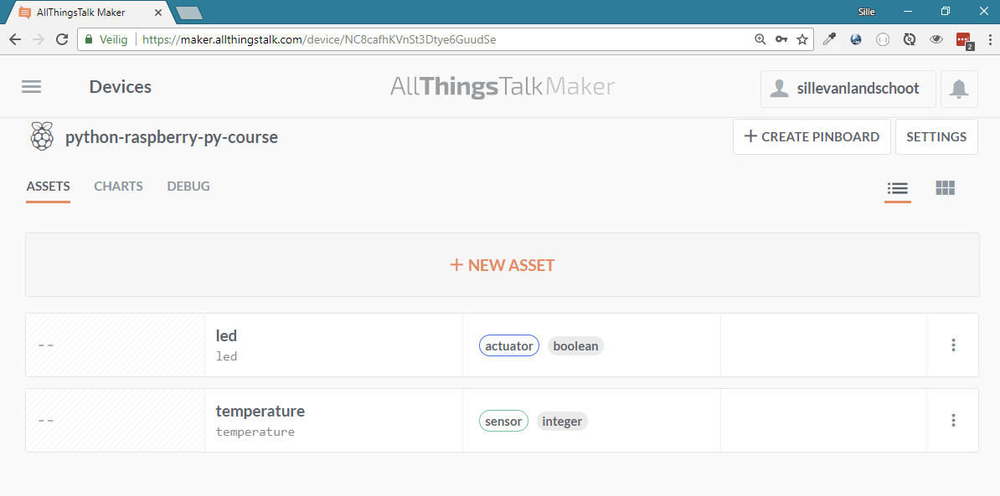
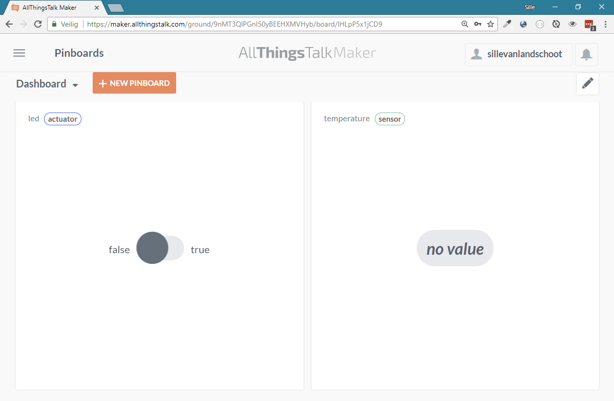

# AllThingsTalk

The AllThingsTalk Cloud is an IoT Application Enablement platform for prototyping and full scale product deployment.

Connect your devices with web services, let them interact using when-then rules, and store as well as visualise data using mobile or web dashboards.


## Maker

AllThingsTalk Maker, the Cloud Instance for Prototyping is free to use for developers and innovators. You can discover the accessible functionality of the AllThingsTalk Cloud and experiment to learn how to put the Internet of Things to use in your line of business.


### Create account


### Devices

After loggin in to the maker, no devices are available. The maker will suggest to connect your hardware by connecting a new device. Connecting a new device is pretty easy. Just click on the button 'Connect a device'.


#### Device type

AllThingsTalk supports multiple types of devices. They make a distinction between `LPWAN devices` such as LoRaWAN NB-IoT, and `WIFI/LAN devices`. The Raspberry Pi in this course makes use of Ethernet/WIFI so, you must choose the option `WIFI/LAN devices`.

A list of templates and kits will be shown. Select under `Your own hardware` the option `Raspberry Pi`


#### Device name

In the next step, we need to choose a name for the device. This can be anything. Lets pick `python-raspberry-py-course`, and then click on the `Connect` button.


Now we have created a device in the AllThingsTalk Maker dashboard.

### Assets

A single device can contain multiple sensors and actuators. AllThingsTalk calls these sensors and actuators `Assets`. AllThingsTalk differentiates the following asset *kinds*:

* **Sensor**: Send information that is send from the device to the cloud.
* **Acutator**: Used by the device to receive information from the cloud.
* **Virtual**: Have no link with a physical device. They hold a higher-value knowledge, mostly calculated from other assets.
* **Config**: A static value that can be used as setting or in calculations (multipliers, limits, thresholds,...) This kind is not directly available when creating a new asset.

Assets also have a type property. Assets can be of the following types:

* Number
* Integer
* String
* Boolean
* Geo

#### Manually adding assets

Assets can be created in the AllThingsTalk Maker by clicking on the `Create asset` button.


A form will show up with some questions about the new asset. The asset *kind*, *name* and profile *type* can be configured. Lets create a temperature asset by using the following settings.


Another example is an actuator that we could use to toggle a led from within the cloud environment.


The assets overview page should now show both assets that we have created for the `python-raspberry-py-course` device.



#### Adding assets in Python

It is also possible to define and add assets using the Python library. This feature will be discussed in the chapter [Python Library](#python-library)

### Pinboards

The created assets for the device are not really visually appealing. AllThingsTalk solves this by providing highly configurable `Pinboards`. While we are on the asset overview page the easiest way to add the assets to a pinboard is by clicking on the &#x22ee; icon on the right of the corresponding asset. From the dropdown menu click on `Pin to board` and then select the pinboard. The default pinboard is called `Dashboard`. Repeat this for the other asset as well.


Now that all the assets are pinned to the `Dashboard`, lets take a look on how AllThingsTalk will represent the assets. Click on the
&#9776; icon to display the menu, and then click on `Pinboards`. This will show the `Dashboard` pinboard where we just added some assets.


On the `Dashboard` pinboard we can see the two assets that we created and added earlier. Note that the led asset is clickable. The state of the toggle button will be transmitted to the device and the device can than handle the change of state. The temperature assets is also showing, but at the moment it only displays `no value`.



 At this time there is no connection or communication with a real device such as our Raspberry Pi. The connection can be made with the use of many programming languages. In the next chapter we will checkout on how to create a connection between our Raspberry Pi and the Dashboard by using the Python library provided by AllThingsTalk.

## Python Library

AllThingsTalk provides many libraries or SDK's (Software Development Kits) for different platforms and programming languages. More information can be found on http://docs.allthingstalk.com/developers/ But for now lets take a look at the Python library.

The full documentation can be found at https://allthingstalk.github.io/python-sdk/ and the source code is openly available at https://github.com/allthingstalk/python-sdk

### Installing allthingstalk library

First lets install the library. For this we will use the `pip3` package manager of Python. This will install all necessary components and code for the AllThingsTalk library.

Open up a command line terminal and type in the following command:

```
pip3 install allthingstalk
```

Now that we have `allthingstalk` library available on the system, lets use it with Python.
Create a new Python script.

### Importing libraries

```python
from allthingstalk import *
```

### Setting authentication

To make connection with your correct and personal device we need to provide some way of identification and authentication. In your code you need to provide a `DEVICE_ID` that identifies your device, and a `DEVICE_TOKEN` that acts as a kind of password to prevent unwanted users of accessing and controlling your device.

```python
# Parameters used to authorize and identify your device
# Get them on maker.allthingstalk.com
DEVICE_TOKEN = '<DEVICE_TOKEN>'
DEVICE_ID = '<DEVICE_ID>'
```

The device token and id are automatically generated by AllThingsTalk and can be found in the device settings. Replace the values between `<` `>` with the generated token and id.

```
Devices -> Settings -> Authentication
```


Click on the clipboard icons to copy the values for the device token and device id to the clipboard. The values are unique for every device so make sure to use your personal token and id.

### Creating custom Device class

Now it is time to describe the device that we created earlier in the Maker using Python. The best way to describe a type is by creating a class. The class should have a name, in this case we could call it `TPDevice` (short for TouchberryPiDevice). The class needs to inherit some behavior from the `Device` class that was provided by the AllThingsTalk library.

Next we need to provide some attributes for our new class. These attributes *must correspond* with the names of the assets that we created for our device. In this case this is a `temperature` and `led` attribute. The attributes must be loaded with an asset object. Therefore we can use the `XAsset()` methods provided by the library. In our case this is the `NumberAsset()` and `BooleanAsset()`.

By default an asset will be set as `sensor`. If need to change the `kind` of the asset to `actuator`, you can provide the information as an argument of the `XAsset()` method.

Earlier we mentioned that assets could be created from within Python as well. This is just as easy as providing an extra attribute to the device class. For example lets add a `button` attribute of the `StringAsset()` type. This could be used to communicate a pressed button to the cloud by providing its name as a `String` value (text).


```python
class TPDevice(Device):
    temperature = NumberAsset(unit='°C')
    led = BooleanAsset(kind=talk.Asset.ACTUATOR)
    button = StringAsset()
```

#### Asset types

The supported asset types in the Python library are

```python
NumberAsset()
IntegerAsset()
StringAsset()
BooleanAsset()
GeoAsset()
```

More information can be found in the API documentation: https://allthingstalk.github.io/python-sdk/api.html#assets

### Connecting to AllThingsTalk

Now that we have description of how our device is composed, we are ready to create a connection to the AllThingsTalk cloud. Therefore we need to create a `client` object. This client object is responsible for sending and receiving information between our program (The Pi) and the cloud. The `DEVICE_TOKEN` is needed to authenticate our application to the cloud.

Not only do we need a client to make connection to the cloud, we also need to tell which device we want to communicate with. Therefore we need to create an instance of the class we created earlier. The class needs the `client` object and the `DEVICE_ID` to identify itself to the cloud.

```python
client = Client(DEVICE_TOKEN)
device = TPDevice(client=client, id=DEVICE_ID)
```

Now we have a `device` object that we can use to interact with (set properties and call methods). All these interactions will be translated to communication that is send back and forth to the cloud. Changes in the applications will reflect in the dashboard, and vice versa.

### Sending changes to the cloud

Asset values will be send to AllThingsTalk automatically. Check your asset values for the device or check your Pinboard for updates.
Lets send a hard-coded temperature value to the dashboard by simply assigning a new value to the temperature attribute of the device object.

When executing the code, make sure to check the dashboard as well, the value will be updated in real-time.

```python
device.temperature = 12.34
```

### Receiving changes from the cloud

To receive changes from the cloud, we need to provide an *actionhandler*. An actionhandler is a method that will be called in case of an event. An event could be the receiving of a new state for an asset. For example if we want to receive an update for our led, we could write something like this:

```python
@TPDevice.command.led
def on_led_update(device, value, at):
    print('Update led state to: ' + value)
```

Lets break this down a bit.

The first line contains `@TPDevice.command.led` and is called a `decorator`.  This decorator will link the method defined on the next line to a `command`. The command is something that will be triggered upon receiving a new value from the cloud.

The next line is the function declaration. We give the function a name (in this case `on_led_update`), and provide arguments that can be passed when the event calls this function. The event will automatically provide extra information about the event through these arguments. `device` will contain the device object that received a change. `value` will contain the new value that was send from the cloud. `at` will contain a timestamp of the exact moment that the event occurred.

In the function definition we can execute code and make use of the provided arguments. In this example we will print out the newly receive `value`. The `device` and `at` are ignored in this example.

## Example

When putting this all together, we get a program that looks like this.

```python
#!/usr/bin/env python3

from time import sleep

from allthingstalk import *

# Parameters used to authorize and identify your device
# Get them on maker.allthingstalk.com
DEVICE_TOKEN = '<DEVICE_TOKEN>'
DEVICE_ID = '<DEVICE_ID>'

class TPDevice(Device):
    temperature = NumberAsset(unit='°C')
    led = BooleanAsset(kind=Asset.ACTUATOR)
    button = StringAsset()

client = Client(DEVICE_TOKEN)
device = TPDevice(client=client, id=DEVICE_ID)

@TPDevice.command.led
def on_led_update(device, value, at):
    print("Update led state to: %s" % value)

device.button = "up"

for i in range(10):
    value = (random.random() * 20) + 10
    print(value)
    device.temperature = value
    sleep(1)
```

## AllThingsTalk on a mobile device

AllThingsTalk also provides mobile applications for iOS and Android. Download and try it out for yourself. More information about the apps can be found on http://docs.allthingstalk.com/cloud/general/mobile/ 

## Exercise

Now that we know how to push and pull information from the AllThingsTalk cloud, you could try to integrate this with the Touchberry Pi. Some examples could be:

* Send the temperature to the AllThingsTalk dashboard. It can be displayed by showing the current value, or in a chart.
* Create one or more actuators to enable the remote control for the different leds
* Show the name of the button that is being pressed.

Other but more difficult examples are:
* Use a `Knob` control to change the brightness for one, some or all leds
* Use a `Input` control to change the color of one, some or all leds
* A temperature alarm that will display a warning when the temperature is to high or to low
* Control the speed and color parameters from the cloud for the running light application

<!-- TODO -->
