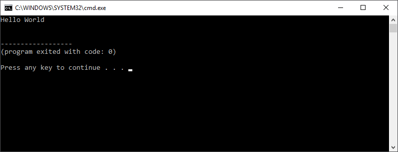

# Hands on Python

In the following tutorials we will get our hands dirty and dive into some Python coding.

* [Prime Numbers](../hands_on_python/prime_numbers.md)
* [An LED class](../hands_on_python/led_class.md)
* [Solutions](../hands_on_python/solutions.md)

On the Raspberry Pi stations provided for the workshop you can use the Geany editor (found under `Start => Programming => Geany`). By selecting `File => New` you can create a new python script. Make sure to save it with a `.py` extension before starting. This way Geany will know we are writing python code.

If you wish you can start by creating a "Hello World" application using the code below.

```python
print("Hello World")
```

Save the script as `hello.py`. Next press `F5` or select `Build => Execute` to run the script. You should get a window with the text "Hello World" as shown in the following screenshot.



Create new scripts for each tutorial. If you wish you can later email them to yourself.
