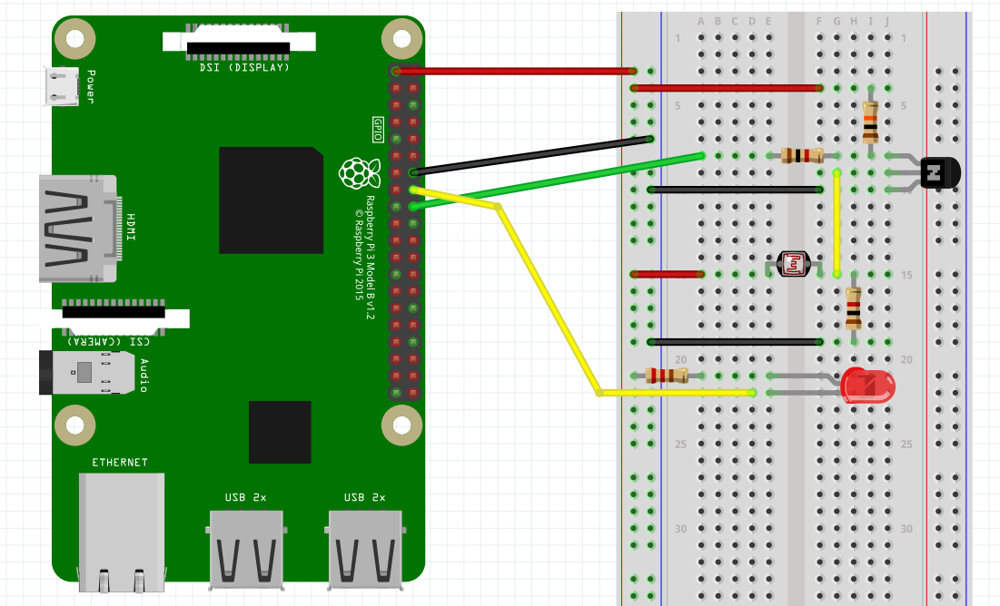

## Combining the LED and the LDR switch

The goal of this guide is to connect an LED to the Raspberry Pi GPIO's and turn it on and off using an LDR schematic connected to another GPIO. This guide combines both previous hardware setups.

### BreadBoard

If everything went ok than you should have the LED from the previous tutorial connected to **GPIO23** and the LDR input line connected to **GPIO24**. The result should be similar to the breadboard image shown below.

### Challenge

If you managed to complete both previous code guides than you should have two files:

* `led_hw.py`: A python script that contains an LED class (the loop to flash the LED is off less importance here)
* `ldr_hw.py`: A python script that contains an LDR class and a loop that endlessly reads the state of the LDR with a small delay between each iteration.

If not than consult the solutions section for both scripts.

Create a new script `led_ldr_combo.py` and try to combine the content of both scripts to create a python program that endlessly reads the state of the LDR. When the LDR is lit, it should turn the LED on. Turn the LED off if the LDR goes dark.

The full solution can be found in the solutions section.
