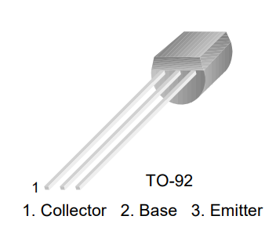
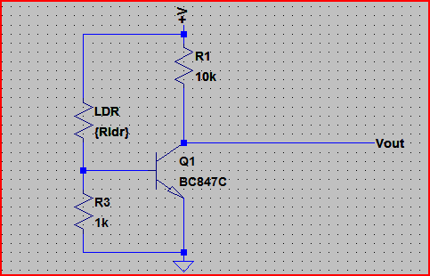
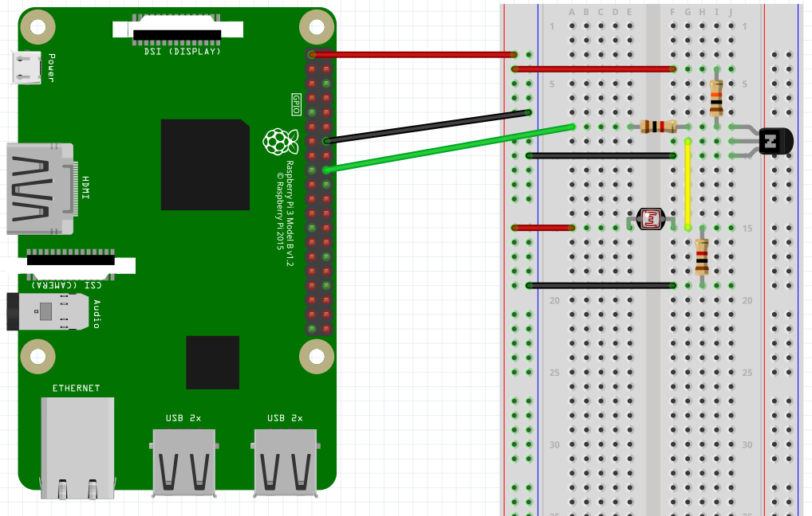

## Using an LDR as a switch on the Raspberry Pi's GPIO Pins

<!-- TODO: Refactor so it is more of a guide than a challenge -->

The goal of this guide is to connect an LDR to the Raspberry Pi GPIO's and reading its state in a loop. This results in a light dependent switch.

### Introduction

The Raspberry Pi has several GPIO (General Purpose Input Output) pins that can be used to connect all kinds of hardware. Using a little software you change their state to be HIGH (`1`) or LOW (`0`) or you can read the value that external hardware is presenting at the input.

This hands on will guide you through the process of attaching an LDR (Light Dependent Resistor) to a GPIO of the Raspberry Pi and reading its state via a small Python script.

In addition to your Raspberry Pi running Raspbian, you will also need:

* A Breadboard
* An LDR
* A 1k resistor
* a 10k resistor
* a 220 ohm resistor
* an general purpose NPN transistor such as BC547
* Three male-female jumper wires
* Three or four male-male jumper wires

Most of this can be found in the Arduino Starter Kit provided. The jumper wires can be found in a separate box provided by the lector.

Always consult the datasheet of components that have multiple pins or polarities as no to connect any of the terminals to the wrong connections. The most critical part here is the NPN transistor. The connections are shown below and were found in the datasheet.



An LDR is a component that has a (variable) resistance that changes with the light intensity that falls upon it. This allows them to be used in light sensing circuits. The Raspberry Pi has no analogue to digital converter (ADC) on board so we actually cannot read in the actual resistance value.

### Hardware Schematic and BreadBoard

The best way to read an LDR state (`ON` or `OFF`) is by using a transistor as a comparator as shown in the schematic below.



It uses the LDR as the upper part of a voltage divider. When the LDR resistance drops, the voltage at the transistor base rises and turns it on. The transistor can be any general purpose NPN.

The first part of this circuit is the LDR and the base resistor. Together they work as a voltage divide. When the light is off, the LDR resistance is very high and then the voltage that goes to the base of the transistor is very low, making the GPIO pin go HIGH.

When the light is on, the LDR resistance is very low and the voltage going to the base of the transistor is enough to activate the circuit and makes the GPIO pin go LOW since the current will flow to the path of less resistance, which is to the GND.

We can calculate the resistor value based on whereabouts we want the turn on to happen.

Let's say the LDR resistances goes from 200Ω (light) to 10kΩ (dark). We want the transistor to turn on when the LDR is at 5kΩ. The supply (Vcc) is at 3.3V. A typical NPN transistor turns on at around 0.7V, so if we do:

`5,000 * (0.7 / 3.3) = 1060Ω` needed for the base resistor. We can pick a 1kΩ resistor since it's near enough.

Deciding what GPIO pin to use is not always easy. You need to make sure you are connecting to an already used pin or to a pin with a special function. A website such as [https://pinout.xyz/](https://pinout.xyz/) can be a nice aid.

Available GPIO pins are: GPIO18, GPIO23, GPIO24, GPIO25, GPIO12, GPIO16, GPIO17, GPIO27, GPIO22, GPIO5, GPIO6, GPIO26.

Here we make use of **GPIO24** to connect output of our comparator.

Connecting everything correctly should show a similar result to the image shown below.



### Example program

A small example program that read's the state of the GPIO pin is shown below:

```Python
import wiringpi

wiringpi.wiringPiSetupGpio()    # Use GPIO numbering

LDR = 24    # Use GPIO24 for the LDR

wiringpi.pinMode(LDR, 0)        # Set LDR pin to 0 ( INPUT )

state = wiringpi.digitalRead(LDR)

print("State = " + str(state))

print("Done")
```

Save this program in a python file called for example `ldr.py`. Use `python3 ldr.py` as a command to execute the program.

### Guide

Try to alter the program to read the state of the LDR in a endless loop. Do make sure to add a delay between reading the state using the `sleep()` function of python.

You can import the sleep function to introduce a delay in your code:

```python
from time import sleep

sleep(1)      # Sleep (seconds)
```

If you wish to have another challenge you can also add an LED to turn on and off based on the state of the LDR. Check out [Turning on an LED with your Raspberry Pi's GPIO Pins](../hands_on_rpi_hardware/led.md) for more information.
