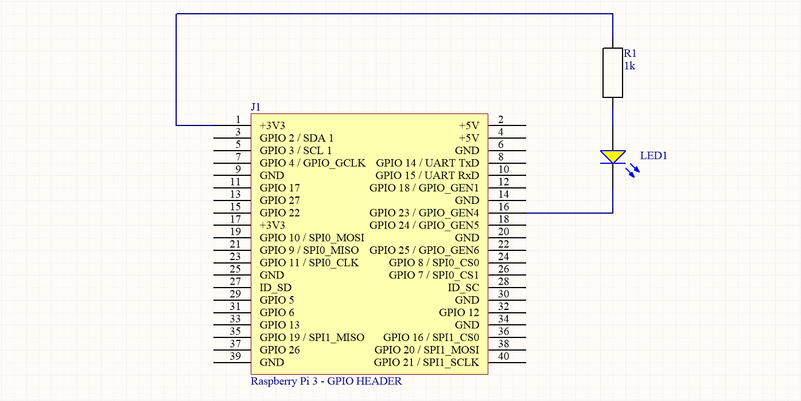
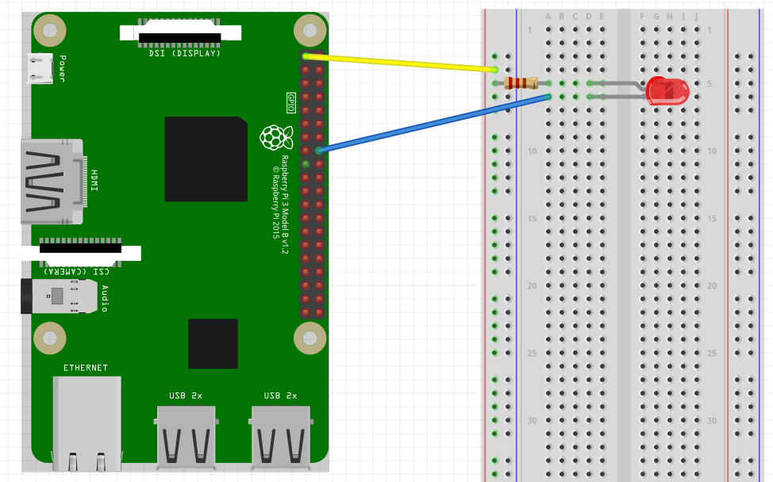

## Turning on an LED with your Raspberry Pi's GPIO Pins

* **Difficulty**: beginner
* **Goal**: Connecting an LED to the Raspberry Pi GPIO's and turning it on and off in a loop. This results in a flashing LED.

### Introduction

The Raspberry Pi has several GPIO (General Purpose Input Output) pins that can be used to connect all kinds of hardware. Using a little software you change their state to be HIGH (`1`) or LOW (`0`) or you can read the value that external hardware is presenting at the input.

This hands on will guide you through the process of attaching an LED to a GPIO of the Raspberry Pi and controlling it via a small Python script.

In addition to your Raspberry Pi running Raspbian, you will also need:

* A Breadboard
* An LED
* A 1k resistor
* Two male-female jumper wires

Most of this can be found in the Arduino Starter Kit provided. The jumper wires can be found in a separate box provided by the lector.

The LED has an anode and a cathode side. The anode side should be connected to the positive supply, while the cathode should be connected to the ground.

A diagram to identify both sides is shown below:
![Cathode and Anode of an LED[^1]](img/ledwiring.jpg)

[^1]: Source http://www.blocksignalling.co.uk/index.php/traffic-lights-module-common-anode-tlc2a

If we were to connect the LED directly to the power supply it would draw infinite current and blow up. To limit the current we need to place a resistor in series with the LED (as shown in the schematic in the next section). For this a 1k resistor can be used.

![A 1k resistor[^2]](img/1k_resistor.jpg)

[^2]: Source https://www.pinterest.com/pin/794040978023017042/?autologin=true

While a 1k resistor works to limit the current through the LED, it will not be ideal for the voltage and type of LEDs used here. In practice you should always take the voltage drop of the LED, the power supply and the preferred current (often 10mA) into account. There are various sites you can use for this like for example: [http://www.ohmslawcalculator.com/led-resistor-calculator](http://www.ohmslawcalculator.com/led-resistor-calculator).

### Hardware Schematic and BreadBoard



It is important not to make the GPIO provide to much power as these are directly connected to the processor pins and no protection for overcurrent is provided. A microcontroller / microprocessor is not able to provide much current.

By connecting the anode side of the LED to VCC (+3V3 in this case) via a resistor, we actually do not let the GPIO source the current. The current is sourced by the power supply and it is sinked via the GPIO. A GPIO is often able to sink much more current than it can source.

Deciding what GPIO pin to use is not always easy. You need to make sure you are connecting to an already used pin or to a pin with a special function. A website such as [https://pinout.xyz/](https://pinout.xyz/) can be a nice aid.

Available GPIO pins are: GPIO18, GPIO23, GPIO24, GPIO25, GPIO12, GPIO16, GPIO17, GPIO27, GPIO22, GPIO5, GPIO6, GPIO26.

Here we make use of **GPIO23** to connect the cathode of the LED.

Connecting everything correctly should show a similar result to the image shown below.



### WiringPi Package

WiringPi is a PIN based GPIO access library written in C for the BCM2835 used in the Raspberry Pi. It's released under the GNU LGPLv3 license and is usable from C, C++ and RTB (BASIC) as well as many other languages with suitable wrappers. It's designed to be familiar to people who have used the Arduino wiring system.

WiringPi includes a command-line utility `gpio` which can be used to program and setup the GPIO pins. You can use this to read and write the pins and even use it to control them from shell scripts.

We will be using the WiringPi Python package to control the GPIO pins.

More information can be found at the GitHub page [https://github.com/WiringPi/WiringPi-Python](https://github.com/WiringPi/WiringPi-Python)

You can install the package on your Raspberry Pi by executing the following command:

```shell
pip3 install wiringpi
```

### Example program

A small example program that turns the LED on and back off after 1 second is shown below:

```Python
import wiringpi
from time import sleep

wiringpi.wiringPiSetupGpio()    # Use GPIO numbering

LED = 23    # Use GPIO23 for the LED

wiringpi.pinMode(LED, 1)        # Set LED pin to 1 ( OUTPUT )
wiringpi.digitalWrite(LED, 0)   # Write 0 ( LOW ) to LED pin
sleep(1)
wiringpi.digitalWrite(LED, 1)   # Write 1 ( HIGH ) to LED pin

print("Done")
```

Save this program in a python file called for example `led.py`. Use `python3 led.py` as a command to execute the program.

### Questions

Can you explain why the LED burns when the GPIO is made low instead of high?

### Challenges

Try to alter the program to:
* Turn the LED on and off in an infinite loop with a chosen delay
* Turn the LED on and off 10 times and then quit the program
