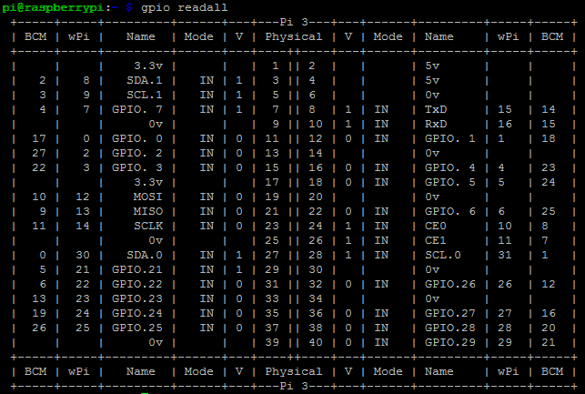

# Hands on Raspberry Pi Hardware

The following tutorials will guide you through some basic interfacing with hardware. Each guide consists of a hardware setup that needs to be build and a Python script to interact with the hardware. At the end some challenges are presented to encourage you to build upon the current setup.

The following hands on guides are available:
* [Turning on an LED with your Raspberry Pi's GPIO Pins](../hands_on_rpi_hardware/led.md)
* [Using an LDR as a switch on the Raspberry Pi's GPIO Pins](../hands_on_rpi_hardware/ldr.md)
* [Combining the LED and the LDR switch](../hands_on_rpi_hardware/combination_led_ldr.md)
* [Solutions](../hands_on_rpi_hardware/solution.md)

Each of these will make use of the WiringPi package.

## WiringPi Package

WiringPi is a PIN based GPIO access library written in C for the BCM2835 used in the Raspberry Pi. It's released under the GNU LGPLv3 license and is usable from C, C++ and RTB (BASIC) as well as many other languages with suitable wrappers. It's designed to be familiar to people who have used the Arduino wiring system.

We will be using the WiringPi Python package to control the GPIO pins.

More information can be found at the GitHub page [https://github.com/WiringPi/WiringPi-Python](https://github.com/WiringPi/WiringPi-Python)

You can install the package on your Raspberry Pi by executing the following command:

```bash
pip3 install wiringpi
```

WiringPi also includes a command-line utility `gpio` which can be used to program and setup the GPIO pins. You can use this to read and write the pins and even use it to control them from shell scripts.

It may be required to build and install this separately:

```bash
sudo apt install build-essential
cd
git clone https://github.com/WiringPi/WiringPi.git
cd WiringPi
./build
```

To read all GPIO pin states you can issue the command

```bash
gpio readall
```

This should output something similar to:



## WiringPi vs RPi.GPIO

WiringPi is a C library while RPi.GPIO is native a Python module. Bindings have been provided for other languages like Python and Java. WiringPi has the advantage that it comes with a command line utility called `gpio` which can be run by a non-root user. This utility makes it possible to control GPIO pins from the command line. Read about it here: [http://wiringpi.com/the-gpio-utility/](http://wiringpi.com/the-gpio-utility/).

WiringPi doesn't need to be run as root, but programs built with the RPi.GPIO module do need to be run as root.

WiringPi also has a lot more features available such as SPI, I2C, Gert board support, ...

## Gpiozero

A newer GPIO library for the Raspberry Pi is [gpiozero](https://gpiozero.readthedocs.io/en/stable/#). Created by Ben Nuttall of the Raspberry Pi Foundation and other contributors it is released under an MIT-type free software license.

While newer than Rpi.GPIO and WiringPi, it is now generally recommended to use it for new programming. It can have a longer learning curve because it offers more features than Rpi.GPIO and WiringPi, but the resulting code is usually very clean and readable.
