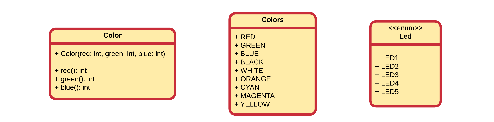

## The TouchBerry Pi LEDs

Driving LEDs directly from the GPIO pins is not always a good idea for several reasons:
* LEDs draw currents of 10mA and more. Not all processors can drive/sink these currents.
* RGB LEDs require 3 pins per LED. So attaching several LEDs (5 in our case), takes up a lot of GPIO pins.

It is a much better idea to use a constant current LED driver that interfaces via some general known bus protocol such as I2C or SPI. This keeps the GPIO pins available for other hardware and also limits the current consumption via the processor.

In our case the RGB LEDs are driven via a TLC59116 constant current LED driver that interfaces with the Raspberry Pi via I2C. The only downside is that you typically need to develop a small driver to communicate with the external chip. Often libraries can be found for popular platforms. In the case of this course, we developed a driver for you.

### The Touchberry Pi shield class

The LED driver for the TouchberryPi shield is available via the TouchberryPi shield class. This class provides some methods to access the LEDs and set their color. A UML diagram of the `TouchberryPi` class is shown below.


Before you can use this class you will need to install the package using `pip3 install touchberrypi` and also import the module into your application.

```python
from touchberrypi import TouchberryPi
```

To make use of the shield driver you will need to make an object of the `TouchberryPi` class.

```python
shield = TouchberryPi()
```

Some extra auxiliary classes are available that need to be imported:

```python
from touchberrypi import Color
from touchberrypi import Colors
from touchberrypi import Led
```



The colors of all the LEDs can be set by creating an object of the `Color` class and passing this to the `set_all_leds()` methods. To create an object of the class `Color` you need to pass the three components: red, green and blue. You can also make use of the `Colors` class that contains some predefined colors. The example code below shows how to make use of both. First with a custom color and next with a predefined color.

```python
from time import sleep
from touchberrypi import TouchberryPi
from touchberrypi import Color
from touchberrypi import Colors
from touchberrypi import Led

shield = TouchberryPi()

# Creating your own custom color object
# Arguments are: (red, green, blue)
shield.set_all_leds(Color(233, 45, 23))

# Add some delay
sleep(2)

# Setting a predefined color
shield.set_all_leds(Colors.RED)
```

Alter the code above to loop through some colors.

The LEDs can also be controlled individually by calling the `set_led()` on the TouchberryPi object. You do need to specify the LED you which to set and the color. The LED can be one of the enums `Led.LED1`, `Led.LED2`, `Led.LED3`, `Led.LED4` or `Led.LED5`. Color can again be a custom object or one of the predefined colors. An example is shown in the code below:

```python
from time import sleep
from touchberrypi import TouchberryPi
from touchberrypi import Color
from touchberrypi import Colors
from touchberrypi import Led

shield = TouchberryPi()

# Creating your own custom color object
# Arguments are: (red, green, blue)
shield.set_led(Led.LED1, Color(233, 45, 23))

# Add some delay
sleep(2)

# Setting a predefined color
shield.set_led(Led.LED2, Colors.RED)
```

### Challenge

Alter the code above and give every LED another / random color. You can also set a certain led by giving an integer as index (from 0 to 4). For example:

```python
shield.set_led(0, Colors.RED)
```

The full solution can be found in the solutions section.
