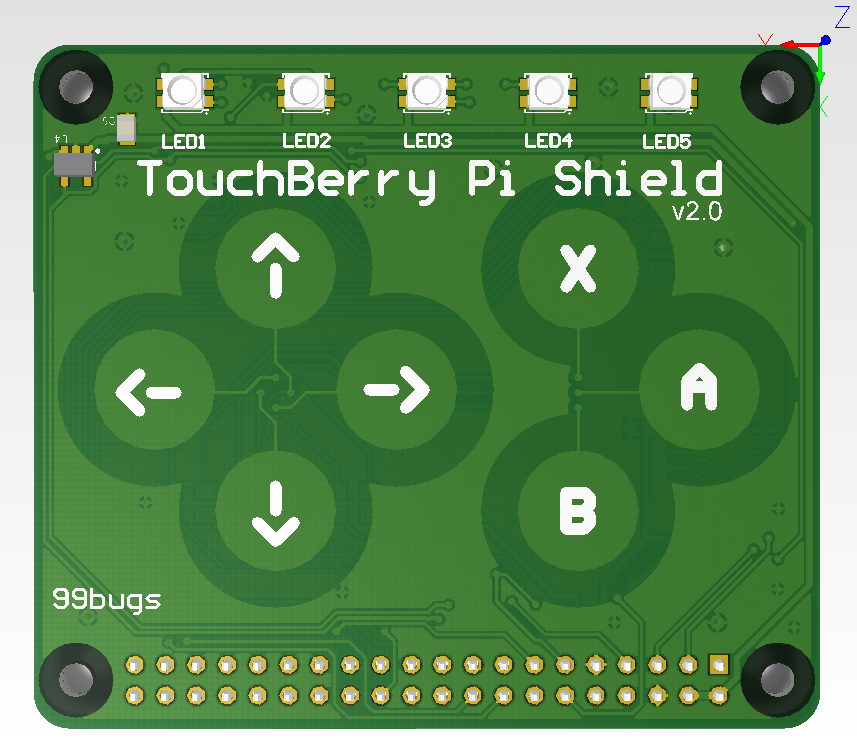

## The TouchBerry Pi Temperature

The Touchberry Pi shield has been equipped with an MCP9800 temperature sensor. It can be seen in the upper left corner of the shield.



### The Touchberry Pi shield class

The communication between the temperature sensor and the Raspberry Pi is realized via i2c. A driver for this is supplied by us and accessible via the `TouchberryPi` class.

A UML diagram of the `TouchberryPi` class is shown below.


To retrieve the sensor temperature all you need is the `TouchberryPi` import.

```python
from touchberrypi import TouchberryPi
```

To make use of the shield driver you will need to make an object of the `TouchberryPi` class.

```python
shield = TouchberryPi()
```

### Example

The example script below reads the temperature every two seconds and displays it via in the terminal.

```python
from time import sleep
from touchberrypi import TouchberryPi

shield = TouchberryPi()

while True:
  temp = shield.temperature()
  print("Shield temperature: " + str(temp) + "°C")
  sleep(2)
```

### Challenge

Show an alarm (for example all LEDs RED) when a certain threshold is reached. It should only be resettable when the user pressed the `X` key.

The full solution can be found in the solutions section.
