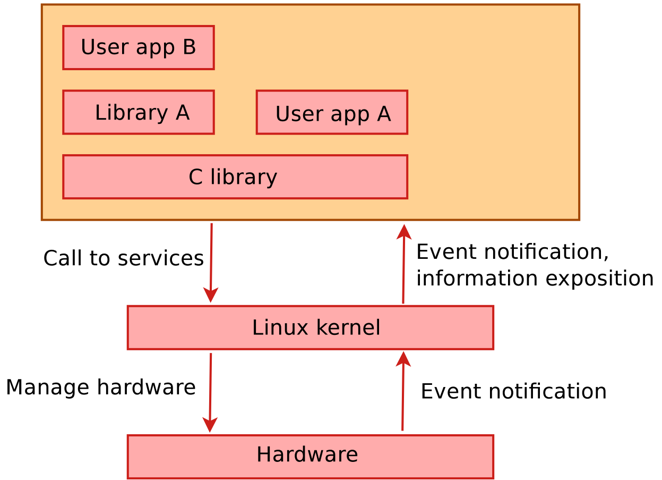
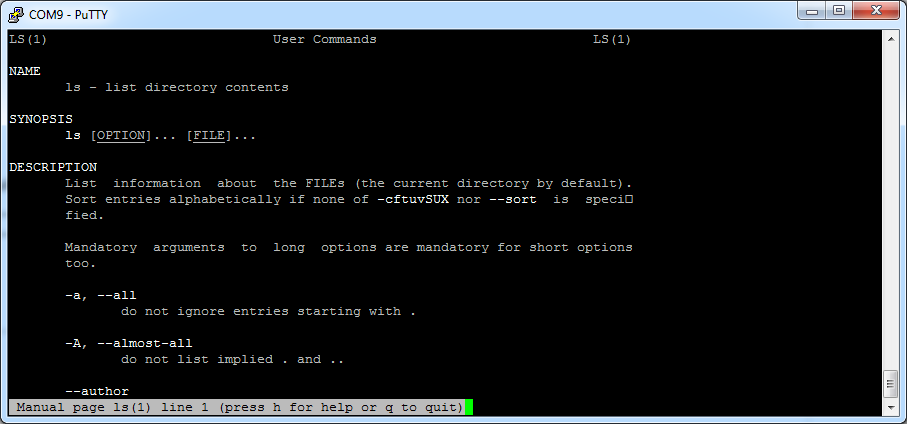
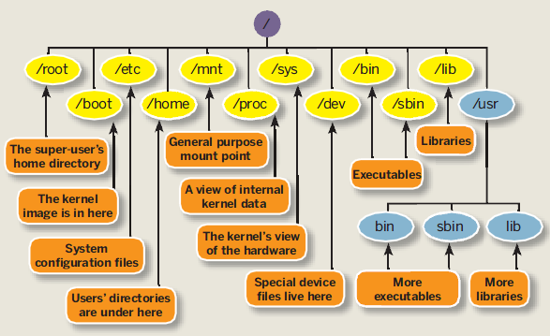

# Linux Basics

The Raspberry Pi 3 embedded system is quite a complex system with a lot of features and complicated hardware. While it is possible to write software that runs directly on the embedded processor (called a bare-metal application) it is way to complex. Typically an Operating System (OS) is installed to manage all the hardware and resources making it easier for software developers to create application to run on the system. That way the hardware can be accessed through services provided by the OS.

Choosing an operating system for an embedded system mainly depends on the hardware as not each operating system will provide support for the embedded system.

Some existing operating systems are shown in the image below:


The main operating systems that have support for the Raspberry Pi 3 are:

* Raspbian, Ubuntu Mate, OSMC, OpenElec, ... (Linux based)
* Windows IoT core (Windows based)
* Risc OS (Real-time OS)

Further down the course we will focus on the Raspbian linux distribution.

> #### Note::
> While the information and examples presented here will be valid for most Linux distro's, some information and commands may only work for Debian based distro's.

## Linux kernel and Linux Distribution

Linux was originally developed as a free operating system for personal computers based on the Intel x86 architecture, but has since been ported to more computer hardware platforms than any other operating system. This includes desktop PCs, servers, mainframes, supercomputers, smartphones, tablets, TVs, embedded systems, ...

Guess what your TV decoder at home is running.

When people refer to linux, it can actually mean two different things.

First is the Linux kernel which was created in 1991 by a Finnish computer science student called Linus Torvalds. It was based on the Minix operating system. Linus made the project open source and allowed people to freely use and contribute to the Linux kernel. Currently the official kernel received contributions from over 12000 programmers.

Second, are so-called "Linux distributions", also called distros. They are complete operating systems that consist of the Linux kernel itself and many other applications and software packages. Because they typically contain a lot of software created by the GNU project, some people (mostly GNU guys themselves) claim that they should be called GNU/Linux instead of just Linux.

When we are talking about embedded Linux we actually are talking about the same kernel code running on millions of other systems. There is no separate code base for embedded systems. When we however build a Linux system for an embedded target we do exclude features we won't be using. We are also cross-compiling the kernel to binary code that can run on the target system.

### The Linux kernel

The Linux kernel **provides the core system facilities** required for any system based upon Linux to operate correctly. It has complete control over everything that occurs in the system. Application software relies upon specific features of the Linux kernel such as its handling of hardware devices and its **provision of many fundamental abstractions** such as virtual memory, sockets, tasks (known as processes), files and many others. A diagram is shown below



The main roles of the kernel are

* Manage all the hardware resources such as CPU, memory, I/O, ...
* Provide a set of portable, architecture - and hardware independent APIs (Application Programmable Interface) to allow user space applications and libraries to use the hardware resources.
* Handle concurrent accesses and usage of hardware resources from different applications. Example: a single network interface is used by multiple user space applications through various network connections. The kernel is responsible for "multiplexing" the hardware resource.

The main interface between the kernel and user space is the set of system calls that are provided by the kernel (about 300 system calls that provide the main kernel services).

These services include:

* file and device operations
* networking operations
* inter-process communication
* process management
* memory mapping
* timers
* threads
* synchronization primitives
* ...

Some key features of the kernel are:

* Portability and hardware support: it runs on most architectures.
* Scalability: Linux can run on super computers as well as on tiny devices (4 MB of RAM is enough).
* Compliance to standards and interoperability
* Exhaustive networking support
* Security: It can't hide its flaws. Its code is reviewed by many experts.
* Stability and reliability
* Modularity: Can include only what a system needs even at run time.
* Easy to program: You can learn from existing code. Many useful resources on the net.

## The MAN-pages

The most important command you need to know is the `man` command, which provides an interface to the reference manuals. By adding a command after the man command you can consult the man-pages for that particular command. These pages provide all the information you need to know to use the command such as general information, a detailed description of the arguments and usage examples. Let's see an example:

```shell
pi@HAL:/$ man ls
```

Which gives the output shown in the image below. We can for example see if we add `-a` after the `ls` command it will also display hidden files (In Linux hidden files start with a dot, for example ".ssh"). You can scroll through the man-pages using the arrow keys.



Searching the current man-page can be done by first typing a slash (`/`), followed by your search term. Jumping to the next hit can be done by hitting the `n` key, while jumping back is done with `SHIFT-n`.

Exiting the man-pages is achieved by hitting the `q` key.

> #### Assignment::The cat command
>
> What does the `cat` command do? How can it be used to output the content of a file? Try to read the file "/proc/cpuinfo"

<!-- How to place a break here? -->

> #### Assignment::The dmesg command
>
> What does the `dmesg` command do?

<!-- How to place a break here? -->

> #### Assignment::The free command
>
> The `free` command shows the system memory usage. How can you make the numbers "human readable"?


## The Linux Filesystem

Based on [Digital Ocean - How To Understand the Filesystem Layout in a Linux VPS](https://www.digitalocean.com/community/tutorials/how-to-understand-the-filesystem-layout-in-a-linux-vps)

### Some brief notes on the History of the Linux Filesystem Layout

Linux inherits many of its concepts of filesystem organization from its Unix predecessors. As far back as 1979, Unix was establishing standards to control how compliant systems would organize their files.

The Linux File system Hierarchy Standard (checkout [Filesystem Hierarchy Standard](http://www.pathname.com/fhs/)), or FHS for short, is a prescriptive standard maintained by the Linux Foundation that establishes the organizational layout that Linux distributions should uphold for interoperability, ease of administration, and the ability to implement cross-distro applications reliably.

One important thing to mention when dealing with these systems is that Linux implements just about **everything as a file**. This means that a text file is a file, a directory is a file (simply a list of other files), a printer is represented by a file (the device drivers can send anything written to the printer file to the physical printer), a serial port is a file, etc.

Although this is in some cases an oversimplification, it informs us of the approach that the designers of the system encouraged: passing text and bytes back and forth and being able to apply similar strategies for editing and accessing diverse components.

### Traversing the Filesystem

Before actually delving into the file system layout, you need to know a few basics about how to navigate a file system from the command line. We will cover the bare minimum here to get you on your feet.

The first thing you need to do is orient yourself in the filesystem. There are a few ways to do this, but one of the most basic is with the `pwd` command, which stands for "print working directory":

```shell
pi@HAL:/$ pwd
/home/pi
```

This simply returns the directory you are currently located in.

To see what files are in the current directory, you can issue the `ls` command, which stands for "list":

```shell
pi@HAL:/$ ls
bin   dev  home  lost+found  mnt  proc  run   selinux  sys  usr
boot  etc  lib   media       opt  root  sbin  srv      tmp  var
```

This will give an overview of all directories and files in your current directory.

The `ls` command can take some optional flags. Flags modify the commands default behavior to either process or display the data in a different way.

The two most common flags are probable `-l` and `-a`. The first flag forces the command to output information in long-form:

```shell
pi@HAL:/$ ls -l
total 88
drwxr-xr-x  2 root root  4096 Jun 20 10:55 bin
drwxr-xr-x  2 root root 16384 Jan  1  1970 boot
drwxr-xr-x 12 root root  3060 Sep 24 13:31 dev
drwxr-xr-x 99 root root  4096 Sep 24 13:31 etc
drwxr-xr-x  3 root root  4096 Jun 20 07:48 home
drwxr-xr-x 12 root root  4096 Jun 20 10:42 lib
-rw-r--r--  1 root root     0 Sep 24 13:37 log.txt
drwx------  2 root root 16384 Jun 20 07:34 lost+found
drwxr-xr-x  2 root root  4096 Jun 20 07:36 media
...
```

This produces output with one line for each file or directory (the name is on the far right). This has a lot of information that we are not interested in right now. One part we are interested in though is the very **first character**, which tells us what **kind of file** it is. The three most common types are:
* `-`: Regular file
* `d`: Directory (a file of a specific format that lists other files)
* `l`: A hard or soft link (basically a shortcut to another file on the system)

The `-a` flag lists all files, including hidden files. In Linux, files are hidden automatically if they begin with a dot:

```shell
pi@HAL:/$ ls -a
.   bin   dev  home  log.txt     media  opt   root  sbin     srv  tmp  var
..  boot  etc  lib   lost+found  mnt    proc  run   selinux  sys  usr
```

The first two entries, `.` and `..` are special. The `.` directory is a shortcut that means "the current directory". The `..` directory is a shortcut that means "the current directory's parent directory".

Now that you can find out where you are in the file system and see what is around you, it is time to learn how to move throughout the file system.

To change to a different directory, you issue the `cd` command, which stands for "change directory":

```shell
pi@HAL:/$ cd /home
pi@HAL:/home$
```

You can follow the command with either an absolute or a relative pathname.

* An **absolute path** is a file path that specifies the location of a directory from at the top of the directory tree. Absolute paths begin with a "/", as you see above.
* A **relative path** is a file path that is relative to the current working directory. This means that instead of defining a location from the top of the directory structure, it defines the location in relation to where you currently are.

For instance, if you want to move to the home directory of the pi user, while in the directory `/home`, you can issue the command:

```shell
pi@HAL:/home$ cd pi
pi@HAL:/home/pi$
```

The lack of the `/` from the beginning tells to use the current directory as the base for looking for the path.

This is where the `..` directory link comes in handy. To move to the parent directory of your current directory, you can type:

```shell
pi@HAL:~$ cd ..
pi@HAL:/home$
```

There is also a shortcut to specify your own homedir, and that is by using the tilde `~`. You can immediately jump to your homedir by for example executing the following command:

```shell
pi@HAL:/$ cd ~
pi@HAL:~$
```
As this is used so much, the developers of the terminal decided to jump to the homedir when not specifying anything:

```shell
pi@HAL:/$ cd
pi@HAL:~$
```

## An Overview of the Linux Filesystem Layout

The first thing you need to know when viewing a Linux file system is that the file system is contained within a single tree, regardless of how many devices are incorporated.

What this means is that all components accessible to the operating system are represented somewhere in the main file system. If you use Windows as your primary operating system, this is different from what you are used to. In Windows, each hard drive or storage space is represented as its own file system, which are labeled with letter designations (C: being the standard top-level directory of the system file hierarchy and additional drives or storage spaces being given other letter labels).

In Linux, every file and device on the system resides under the "root" directory, which is denoted by a starting "/".

Thus, if we want to go to the top-level directory of the entire operating system and see what is there, we can type:

```shell
pi@HAL:/home$ cd /
pi@HAL:/$
```

Every file, device, directory, or application is located under this one directory. Under this, we can see the beginnings of the rest of the directory structure.

One of the principles guiding the organization of the file system is to allow it to be split across multiple disk partitions (or multiple disks) in a rational manner, and to allow appropriate pieces of it to be shared between machines. Key to this is the notion of the root partition (/, the parent of the entire file system).

When Linux boots, the kernel attaches a single file system partition all by itself. This is known as the root partition. Any other partitions that need to be attached are mounted by the mount command, usually under control of entries in the file "/etc/fstab". Because in the early stages of startup, only the root file system is available, it must contain everything needed for the system to function and attach the other pieces of the file system.

Tools on the root partition include the init program (which starts all the other processes), a shell, mount and the "/etc/fstab" file. The File System Hierarchy standard specifies a number of directories that must lie within the root partition.

Below is a typical Linux file system hierarchy.


:   A typical Linux file system hierarchy

Let's take a closer look at the most important directories found under the root `/`.

**/boot** - This directory contains the actual files, images, and kernels necessary to boot the system. While /bin contains basic, essential utilities, /boot contains the core components that actually allow the system to boot. If you need to modify the bootloader on your system, or if you would like to see the actual kernel files and initial ramdisk (initrd), you can find them here. This directory must be accessible to the system very early on.

**/dev** - This directory houses the files that represent devices on your system. Every hard drive, terminal device, input or output device available to the system is represented by a file here. Depending on the device, you can operate on the devices in different ways. For instance, for a device that represents a hard drive, like /dev/sda, you can mount it to the file system to access it. On the other hand, if you have a file that represents a line printer like /dev/lpr, you can write directly to it to send the information to the printer.

**/etc** - Stands for "Editable Text Configuration". This is one area of the file system where you will spend a lot of time if you are working as a system administrator. This directory is basically a configuration directory for various system-wide services. By default, this directory contains many files and subdirectories. It contains the configuration files for most of the activities on the system, regardless of their function. In cases where multiple configuration files are needed, many times an application-specific subdirectory is created to hold these files. If you are attempting to configure a service or program for the entire system, this is a great place to look.

**/home** - This location contains the home directories of all of the users on the system (except for the administrative user, root). If you have created other users, a directory matching their username will typically be created under this directory. Inside each home directory, the associated user has write access. Typically, regular users only have write access to their own home directory. This helps keep the file system clean and ensures that not just anyone can change important configuration files.

Within the home directory, that are often hidden files and directories (represented by a starting dot) that allow for user-specific configuration of tools. You can often set system defaults in the /etc directory, and then each user can override them as necessary in their own home directory.

**/root** - This is the home directory of the administrative user (called "root"). It functions exactly like the normal home directories, but is housed here instead.

**/tmp** - This is a directory that is used to store temporary files on the system. It is writable by anyone on the computer and does not persist upon reboot. This means that any files that you need just for a little bit can be put here. They will be automatically deleted once the system shuts down.

**/var** - This directory is supposed to contain variable data. In practice, this means it is used to contain information or directories that you expect to grow as the system is used.

For example, system logs and backups are housed here. Another popular use of this directory is to store web content if you are operating a web server.

### Overview of Basic Filesystem Commands

The most used commands to traverse and manipulate the file system of a Linux system are listed in the table below. You can always use the man-command to get a detailed description.

|	Command |	Description									|
|-----------|-----------------------------------------------|
|	ls		|	List files									|
|	cp		|	Copy files									|
|	rm		|	Remove files								|
|	mv		|	Move files									|
|	cd		|	Change working dir							|
|	chmod	|	Change file permission mode					|
|	chown	|	Change owner of file						|
|	cat		|	Concatenate files and output to terminal	|
|	touch	|	Create an empty file						|
|	mkdir	|	Make directory								|

## Debian and it's Packages

Every Linux distribution is different in terms of how software is installed. Linux distributions use different installation file types, package managers, and commands for installation. Even within a single form of Linux, there are different types of package managers.

Debian files are usually downloaded by package managers from a software repository. A repository is a collection of Debian files that typically comes from a server or other location. Package managers access these repositories and download the requested Debian file. Then, the package manager installs the package. A package manager is software used to handle the installation, removal, configuration, and updating of programs and drivers on a computer system. If a Debian file is not downloaded from a repository, then the user downloaded or created a Debian file. The local file can still be installed; Debian files are not required to come from a repository, although most do.

Packages generally contain all of the files necessary to implement a set of related commands or features. There are two types of Debian packages:

* **Binary packages**, which contain executables, configuration files, man/info pages, copyright information, and other documentation. These packages are distributed in a Debian-specific archive format; they are usually distinguished by having a '.deb' file extension. Binary packages can be unpacked using the Debian utility dpkg (possibly via a frontend like aptitude).
* **Source packages**, which consist of a .dsc file describing the source package (including the names of the following files), a .orig.tar.gz file that contains the original unmodified source in gzip-compressed tar format and usually a .diff.gz file that contains the Debian-specific changes to the original source. The utility dpkg-source packs and unpacks Debian source archives. (The program apt-get can be used as a frontend for dpkg-source.)

Installation of software by the package system uses "dependencies" which are carefully designed by the package maintainers. These dependencies are documented in the control file associated with each package.

For example, the package containing the GNU C compiler (gcc) "depends" on the package binutils which includes the linker and assembler. If a user attempts to install gcc without having first installed binutils, the package management system (dpkg) will send an error message that it also needs binutils, and stop installing gcc.

There are multiple tools that are used to manage Debian packages, from graphic or text-based interfaces to the low level tools used to install packages. All the available tools rely on the lower level tools to properly work.

It is important to understand that the higher level package management tools such as aptitude or dselect rely on apt which, itself, relies on dpkg to manage the packages in the system.

### DPKG

Dpkg is the main package management program.

### APT

APT is the Advanced Package Tool and provides the apt-get program. apt-get provides a simple way to retrieve and install packages from multiple sources using the command line. Unlike dpkg, apt-get does not understand .deb files, it works with the packages proper name and can only install .deb archives from a source specified in /etc/apt/sources.list. apt-get will call dpkg directly after downloading the .deb archives from the configured sources.

Some common ways to use apt-get are:

* To update the list of package known by your system, you can run:

```shell
$ apt-get update
```

(you should execute this regularly to update your package lists)

* To upgrade all the packages on your system (without installing extra packages or removing packages), run:

```shell
$ apt-get upgrade
```

* To install the foo package and all its dependencies, run:

```shell
$ apt-get install foo
```

* To remove the foo package from your system, run:

```shell
$ apt-get remove foo
```

* To remove the foo package and its configuration files from your system, run:

```shell
$ apt-get purge foo
```

* To upgrade all the packages on your system, and, if needed for a package upgrade, installing extra packages or removing packages, run:

```shell
$ apt-get dist-upgrade
```

### Aptitude

Aptitude is a package manager for Debian GNU/Linux systems that provides a frontend to the apt package management infrastructure. Aptitude is a text-based interface using the curses library, it can be used to perform management tasks in a fast and easy way.

* aptitude offers easy access to all versions of a package.
* aptitude makes it easy to keep track of obsolete software by listing it under "Obsolete and Locally Created Packages".
* aptitude includes a fairly powerful system for searching particular packages and limiting the package display. Users familiar with mutt will pick up quickly, as mutt was the inspiration for the expression syntax.
* aptitude can be used to install the predefined tasks  available.
* aptitude in full screen mode has su functionality embedded and can be run by a normal user. It will call su (and ask for the root password, if any) when you really need administrative privileges

Aptitude is most commonly used for searching for packages. You can use the following command for this:

```shell
pi@HAL:/$ aptitude search foobar
```

You can launch the 'graphical' frontend by running it from the terminal:

```shell
pi@HAL:/$ aptitude
```
