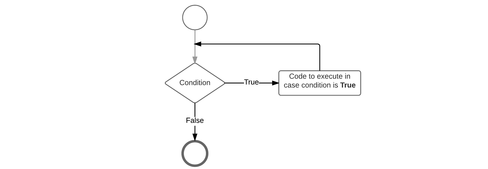

## Loop statements

In general, statements are executed sequentially: The first statement in a block is executed first, followed by the second, and so on. There may however be situations where you need to execute a block of code several number of times. Programming languages provide various structures that allow you to loop a block of statements.

The Python programming language provides the following types of loops to handle looping requirements:

* **for loop**: Execute a code block multiple times and simplify the code that manages the loop variable.
* **while loop**: Repeats a code block while a given condition is true. It tests the condition before executing the body of the loop.

### The for loop

Basically a for loop is most often used when the number of iterations is pre-determined. A typical example would be a list of items where actions needs to be applied to each item in the list.

Python's for loops are pretty different compared to most other languages. The idea of a for loop is rather simple, you will just loop through some code for a certain number of times.

Compared to other languages, Python's for-loop can be compared more to for example an enhanced for-loop from Java or a for-each from Ruby. It does not iterate between a start and end number but iterates over a list or at the pace of iterator.

The for loop adheres to the following construction template:

```Python
for varName in range(start,end,stepsize):
  # Codeblock
```

* **varName**: the name of the local variable taking the value of the current item in the list (often `i`)
* `range` is a function used to create and iterator which starts at `start` (inclusive) and ends at `end` (exclusive). An optional `stepsize` can be provided.

When you're using an iterator, every loop of the for statement produces the next number on the fly.

Also, notice the `in` keyword. This is actually part of the for loop and you will understand it a bit better after we deal with lists and dictionaries.

Each loop around the iteration makes the iterator step one forward and checked against the end-value. If it is not reached yet, the code is executed again and the iterator is increased once more. This continues until the end-value is reached.

Let's see the most simple example possible. A simple for loop that outputs the text `"Hello"` 10 times to the terminal.

```Python
for i in range(0,10):
  print("Hello")
```

Want to see the values of `i`? Use the following code:

```python
for i in range(0,10):
  print(str(i) + ": Hello")
```

This outputs:

```text
0: Hello
1: Hello
2: Hello
3: Hello
4: Hello
5: Hello
6: Hello
7: Hello
8: Hello
9: Hello
```

You can not just specify the start and stop values for the range, but also the step size which should be taken. The step size can be added as a third parameter to the range function. An example with a step size of 2 is shown below.

```Python
for i in range(0,10,2):
  print(str(i) + ": Hello")
```

Which outputs:

```text
0: Hello
2: Hello
4: Hello
6: Hello
8: Hello
```

### The while loop

A while loop statement in the Python programming language repeatedly executes a statement block as long as a given condition is true. The condition is checked before the code block is executed. This means that the code block of the while loop may not even run at all if the condition is not met.

The while loop adheres to the following construction template:

```python
while <condition>:
  # Code Statements
```

This can also be translated into the flow chart shown below.



Below is an example script that print out the first 10 numbers that are dividable by `3`:

```python
divident = 3
currentValue = 1
count = 0

while count < 10:
  if currentValue % divident == 0:
    print("Found that " + str(currentValue) + " is dividable by " + str(divident))
    count += 1

  currentValue += 1
```

The example above shows how an if-statement can be nested inside a while loop. While the number of times you can nest a structure inside another is directly limited it should be kept to a minimum. The deeper structures get nested the more complex your code starts to become.

Which outputs:

```text
Found that 3 is dividable by 3
Found that 6 is dividable by 3
Found that 9 is dividable by 3
Found that 12 is dividable by 3
Found that 15 is dividable by 3
Found that 18 is dividable by 3
Found that 21 is dividable by 3
Found that 24 is dividable by 3
Found that 27 is dividable by 3
Found that 30 is dividable by 3
```

#### Infinite loop

Often one will find a while-loop with the condition replaced by the keyword `True`. This is a loop that will run forever and can only be stopped by using a kill signal (for example process kill or CTRL-C). This is often found in applications that require to run as a daemon (process that runs in the background).

Example of an infinite loop:

```python
from time import sleep

while(True):
  print("Alive ...")
  sleep(1)          # Time in seconds.
```
