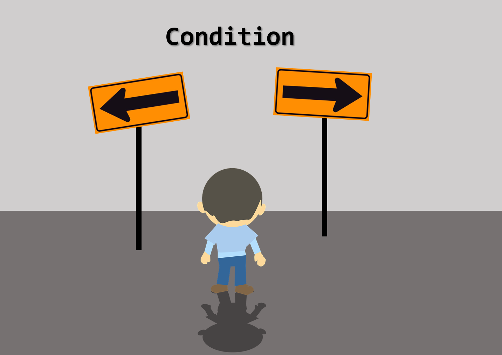
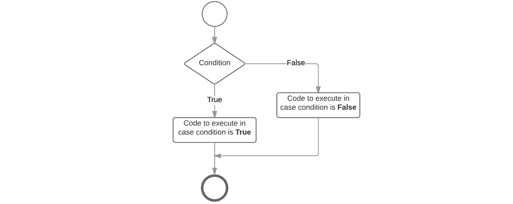
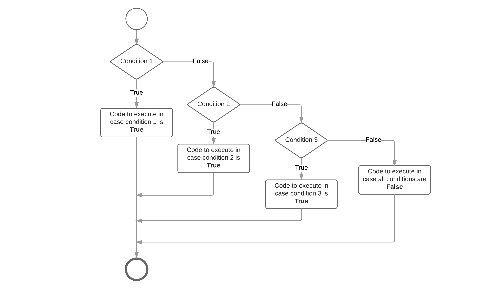

## Making Decisions



The statements inside your source files are generally executed from top to bottom, in the order that they appear. Control flow statements, however, break up the flow of execution by employing decision making, enabling your program to conditionally execute particular blocks of code. This section describes the decision-making statements such as if-then, if-then-else and the if-elif-else statements supported by the Python programming language.

The Python language does not support a switch statement as many other programming languages do.

### Conditions

To allow our program to make certain decisions we first need to take a look at conditions and how they are evaluated.

A condition is some sort of comparison (or a combination of comparisons) that can be evaluated by the compiler or interpreter. After solving all comparisons and combining all the individual parts, the interpreter resolves it to a single resulting value that is `True` or `False` (also keywords in Python). Generally spoken we state that the interpreter evaluates the condition to be true or false.

The true and false values can differ from language to language, however internal in memory false is most of the time "0" and true is "not 0".

#### Comparison Operators

The table below shows the available comparison operators that can be used in Python to build a condition.

| Operator | Short Name| Description |
|---|---|
| `==` | equal | If the values of the two operands are equal, then the condition evaluates to `True` |
| `!=` | not equal | If values of the two operands are not equal, then the condition evaluates to `True` |
| `>` | greater than | 	If the value of the left operand is greater than the value of the right operand, then the condition evaluates to `True`. |
| `>=` | greater than or equal to | If the value of the left operand is greater than or equal to the value of the right operand, then the condition evaluates to `True`.
| `<` | less than | If the value of the left operand is less than the value of the right operand, then the condition evaluates to `True`. |
| `<=` | less than or equal to | If the value of the left operand is less than or equal to the value of the right operand, then the condition evaluates to `True`. |

> #### Warning::Deprecated `<>` comparison operator
>
> Some scripts may also use the not-equal operator `<>` which has the exact same meaning as the `!=` operator. However this former is deprecated and even removed in Python 3.x

Since a conditional statement actually produces a single `True` or `False` result, this result can actually be assigned to a variable.

Let's take a look at some examples of comparison operators:

```Python
a = 4
b = 8
result
result = (a < b)   # True
result = (a > b)   # False
result = (a <= 4)  # a smaller or equal to 4 - True
result = (b >= 9)  # b bigger or equal to 9 - False
result = (a == b)  # a equal to b - False
result = (a != b)  # a is not equal to b - True
```

Note how we need to use two equality signs `==` to test if two values are equal, while we use a single sign `=` for assignment.

While the comparison operators will not often be used in a situation as shown in the code above, they will often be used when making decisions in your program.

#### Conditional Operators

When creating more complex conditional statements you will need to use the conditional operators to create combinations of conditions.

The table below gives an overview of the available conditional operators in Python.

| Operator | Short name | Description |
|---|---|
| `and` | logical and | If both the operands are true then the condition evaluates to `True`.	|
| `or` | logical or | If any of the two operands are non-zero then the condition evaluates to `True`.	 |
| `not` | logical not | Used to reverse the logical state of its operand. |

These work as you know them from the Boolean algebra. The `or` operator will return `True` if either of the operands evaluate to `True`. The `and` operator will return `True` if both operands evaluate to `True`. A logical expression can be negated by placing the `not` operator in front of it.

The code example below checks if a person is a child based on it's `age` (between 0 and 14 years of age).

```Python
age = 16
isAChild = (age >= 0 and age <= 14)      # False
```

### The if statement

The `if` statement is the most basic of all the control flow statements. It tells your program to execute a certain section of code only if a particular condition evaluates to `True`.

Let's take for example a very simple example where we test if the students score is below 70% and if so we output an encouraging speech.

```Python
studentScore = 60     # Change this to test the code below

print("Your score is " + str(studentScore) + "%")
if studentScore < 70:
    print("Come on buddy, you will need to work a little harder.")
    print("You can do it. Still got some time till the exams.")
```

If this test evaluates to `False` (meaning that the score is equal or above 70), control jumps to the end of the if statement.

Important to note it that no parentheses are placed around the condition which is often necessary in other programming languages. Python on the other hand requires a colon `:` after the condition and also requires the code block that need to be executed in case the condition evaluates to `True` to be **indented**. This syntax is very typical of Python and often error prone for beginners. So make sure to take care of your indentation.

An if-statement can also be visually represented using a flowchart as shown below.


### The if-else Statement

The if-else statement provides a secondary path of execution when an "if" clause evaluates to `False`. Taking the previous example you could output a "good job" speech when the students score is equal or above 70%.

```Python
studentScore = 60     # Change this to test the code below

print("Your score is " + str(studentScore) + "%")
if studentScore < 70:
    print("Come on buddy, you will need to work a little harder.")
    print("You can do it. Still got some time till the exams.")
else:
    print("Good job. Keep up the good work.");
```

Note that no condition is required for the `else` clause but is does however follow the same syntax as the if-clause concerning the colon `:` at the end and the indentation required for the code block that must be executed in case the else-clause is reached. The else code block is executed when the if-condition does not evaluate to `True`. This can be visually represented with the flowchart shown below.



### If - elif - else statements

The if-else statement can be extended with **even more if statements**. Each if-clause will need a new condition that needs to be checked. The first one that evaluates to `True` is executed, after which control jumps to the end of the if statements. In Python an extra if-clause is added by using the keyword `elif` which is short version of `else if` used in many other programming languages.

Important to understand is that the conditions of all these clauses are checked sequentially and not parallel. So the second is only checked if the first is not met. The third is only checked if the second and first are not met, and so on ...

Let's extend our grading example to be a bit more student friendly:

```Python
studentScore = 60     # Change this to test the code below

print("Your score is " + str(studentScore) + "%")
if studentScore >= 90:
    print("Omg, good job. Keep up the work.")
elif studentScore >= 70:
    print("Some room for improvement but you are on your way.")
elif studentScore >= 50:
    print("Ok. But you may want to considering studying a bit more.")
elif studentScore >= 30:
    print("Come on buddy, you will need to work a little harder.")
else:
    print("You may want to cancel your holiday vacation for studying.")
```

You may have noticed that the value of `studentScore` can satisfy more than one expression in the code above. Remember that the conditions are checked sequentially and once a condition is satisfied, the appropriate statements are executed and the remaining conditions are not evaluated anymore. The last else-clause is a kind of default path of execution in case none of the conditions are met. This can also be visually represented using a flowchart.



### Combined Conditions

When building conditions one often needs conditional operators to build more complex conditions.

Take a look at the example below that checks if a frequency value is within a valid range using the conditional `and` operator. It only resolves to `True` if both the left and right operand resolve to `True`.

```python
frequency = float(input("Please enter the buzzer frequency (Hz): "))

if (frequency >= 100 and frequency <= 10000):
  print("Buzzing like a hummingbird")
else:
  print("Sorry, invalid frequency")
```

Consider the following example that asks the user to input the value that should be send to the a GPIO. If it is not a valid value (`0` or `1`) than it issues an error.

```python
value = int(input("Would you like to make the GPIO 1 or 0? "))

if value == 1 or value == 0:
  print("Setting IO to " + str(value))
else:
  print("Sorry you entered an invalid value.")
```

Combining with the `not` operator it is easy to invert conditions. The example below checks if the user input contains valid values and if it doesn't it gives the user an error message.

```python
state = str(input("Would you like to make the IO high or low? "))

if not (state == "high" or state == "low"):
  print("Sorry you entered an unknown state.")
elif state == "high":
  print("Making IO go high")
else:
  print("Making IO go low")
```

> #### Warning::Lazy evaluation
>
> These operators exhibit "short-circuiting" behavior, which means that the second operand is evaluated only if needed. This is also called lazy evaluations. So for example in an OR condition, if the first operand is `True`, the outcome must also be `True`. For this reason the second operand is not checked anymore. The same happens with an AND condition. If the first operand resolves to `False`, the second operand is not evaluated anymore and the condition resolves to `False`.

### Nesting if-statements

There may be situations where you want to check for another condition after a condition resolves to `True`. In such a situation, you can use the nested if construct.

In a nested if construct, you can have an if-elif-else construct inside another if-elif-else construct. While there is no hard limit on the nesting level, common sence and code readability dictates not to nest deeper than two levels.

Let us take an example application to calculate the BMI (Body Mass Index) op a person. In this case it is a good idea to check if the user did not accidently enter a height of `0`, which would result in a `ZeroDivisionError` crash.

```python
height = float(input("Please enter your height (m): "))
weight = float(input("Please enter your weight (kg): "))

if height == 0:
  print("Sorry, cannot divide by zero as this would crash the application")
else:
  bmi = weight / (height * height)

  print("Your BMI is " + str(bmi))
  if bmi < 18.5:
    print("You might be a bit underweight")
  elif bmi >= 18.5 and bmi <= 25:
    print("All is normal")
  else:
    print("You might be a bit overweight")
```

Note how the application first checks if the divisor is zero in which case it would skip the bmi calculation. If all is good, the bni is calculated and a nested if-elif-else statement displays a informational message to the user. Also note the combined condition `bmi >= 18.5 and bmi <= 25` which checks if the bmi is inside a range.
