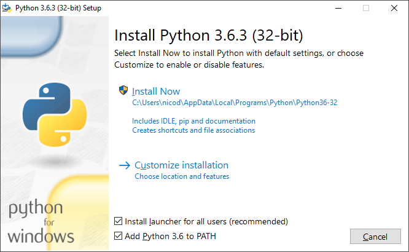

# Introduction

Python is a simple to use programming language that appeals to all sorts of people: scripters, programmers, both beginners and advanced and even kids who learn their first programming skills. It is a high-level language with great support for high-level data types such as flexible arrays and dictionaries. Because of its more general data types it is also applicable to a much larger problem domain then many other programming languages.

Python can be used for all sorts of scripting and applications:
* small and large automation tasks
* database applications
* server side applications
* GUI applications
* simple games
* ...

Python is an interpreted language and therefore offers a much faster development cycle as compilation and linking is not necessary. It is a simple to use language, available on Windows, Mac OS X and Unix operating systems. The Python interpreter can also be used interactively, meaning you do not need to write a script/file just to have some Python fun.

> #### Info::Python the Name
> The language is named after the BBC show "Monty Python's Flying Circus" and has nothing to do with reptiles.

By splitting your program in modules, Python allows you to reuse these modules in other programs. By shipping Python with a large collection of standard modules providing functionality such as file I/O, system calls, sockets, and even interfaces to graphical user interface toolkits a programmer can do more complex task quicker and cleaner.

Python programs can be written very compactly and readable. It's syntax is notable shorter than many other high-level programming languages such as C++, Java, C#, ... It achieves this by
* allowing the developer to express complex operations in a single statement using high-level data types
* by shortening the basic syntax for example for grouping statements - grouping is done by indentation instead of parantheses
* it is not required to declare arguments and variables

It is also possible to extend Python using other popular programming languages such as C and C++.

## Requirements to start using Python

Basically all you need is the Python interpreter which can be downloaded at [https://www.python.org/downloads/](https://www.python.org/downloads/).

Python comes in two flavors. The 2.x version and the 3.x version. Both are not compatible with each other. They even differ in syntax. In short Python 2.x is legacy, Python 3.x is the present and future of the language. Python 3.0 was released in 2008. The final 2.x version 2.7 release came out in mid-2010, with a statement of extended support for this end-of-life release. The 2.x branch will see no new major releases after that. 3.x is under active development and has already seen over five years of stable releases. This means that all recent standard library improvements are only available by default in Python 3.x.

This course will make use of the newer 3.x flavor so make sure to install the correct version.

When installing the package make sure to **add Python to the PATH**.

Just hit "Install Now" and let the wizard do his magic.
