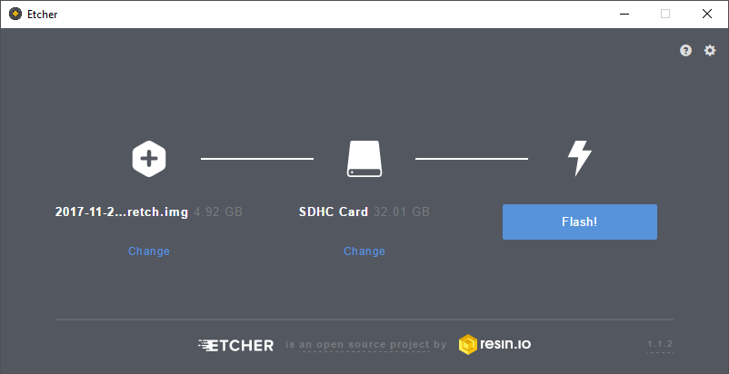
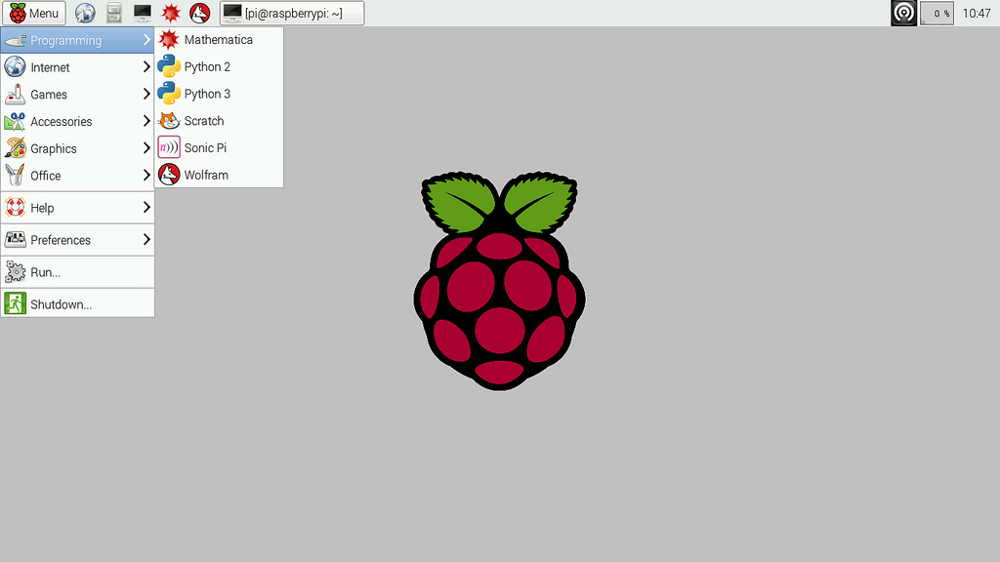
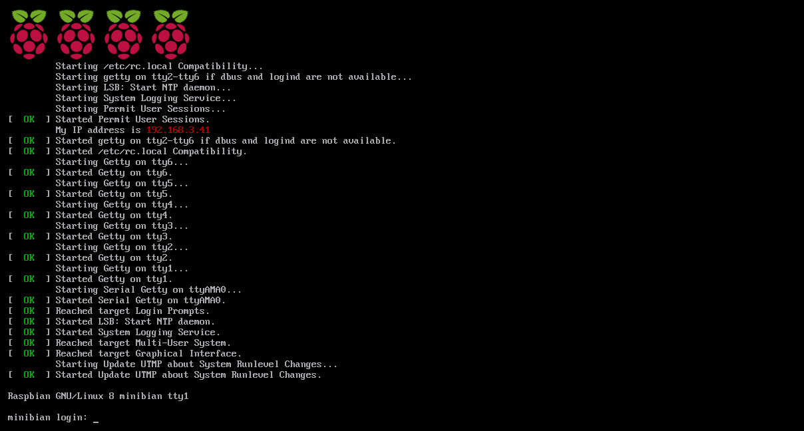
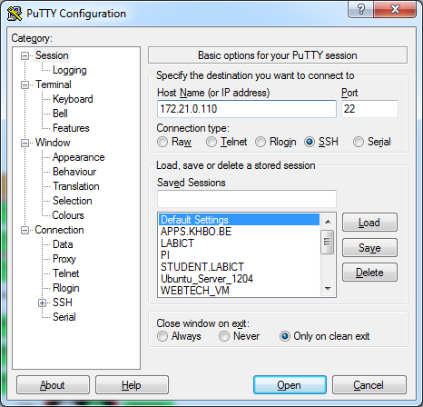
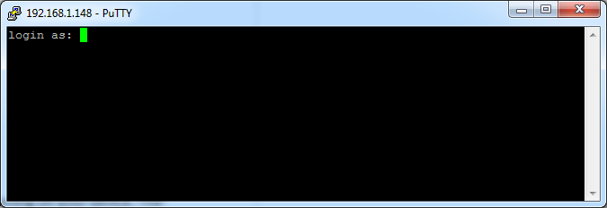
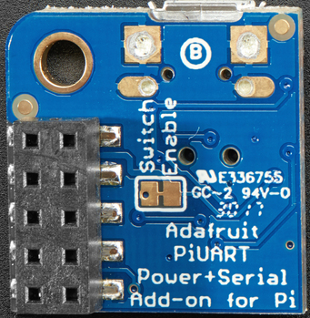
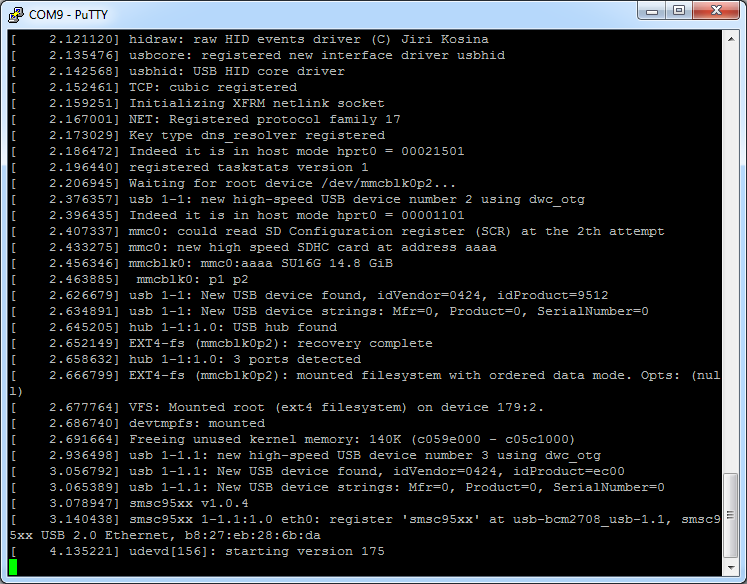
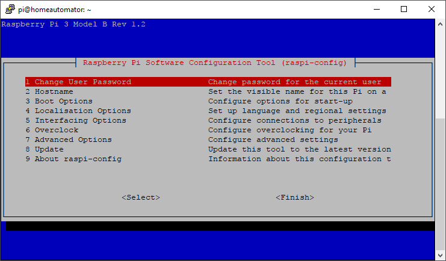

# Operating Systems

The Raspberry Pi foundation provides several ready to use operating system images for the Pi. At the moment of this writing the following are available:

* Raspbian - The Foundation's official supported operating system (Debian Jessie)
* Ubuntu Mate - Official Ubuntu flavor featuring the MATE desktop
* Snappy Ubuntu Core - A new, transactionally-updated Ubuntu for IoT devices, clouds and more
* OSMC - Open Source Media Centre
* OPENELEC - Open Embedded Linux Entertainment Centre
* PINET - Raspberry Pi Classroom Management Solution
* Windows 10 IoT Core
* RISC OS - A non-Linux distribution

For this course we will be using the Raspbian image. While Ubuntu Mate features a nicer graphical environment, it does have some glitches when it comes to the graphical user interface.

While the instructions below on how to boot the Raspberry Pi are based on Raspbian, they are very similar for most other distributions.

## Creating a bootable SD card

You can download the latest image of Raspbian via the Raspberry Pi website ([https://www.raspberrypi.org/downloads/](https://www.raspberrypi.org/downloads/)). Make sure to pick the "Raspbian Stretch with Desktop" edition. Extract the compressed file on your local disk (using 7-Zip or a similar tool). You should get an image file (.img extension).

The current version at the moment of this writing is of November with a Linux kernel version of 4.9. You can always check out the release notes on [http://downloads.raspberrypi.org/raspbian/release_notes.txt](http://downloads.raspberrypi.org/raspbian/release_notes.txt).

To boot this Linux distribution we will need to write the image file to an SD card of at least 8GB. A popular tool to write the image to an SD card is "Etcher by Resin.io" which can be downloaded at [https://etcher.io](https://etcher.io)

> #### Note::Other host operating systems
>
> Check out [http://www.raspberrypi.org/documentation/installation/installing-images/README.md](http://www.raspberrypi.org/documentation/installation/installing-images/README.md) for instructions for different host operating systems such as Linux or Mac.

Select the correct device letter and load the Linux image from your local drive as shown in the image below. If you're ready, hit the write button and grab a cup of coffee. You can also create a backup of your current SD card by reading from the SD card to an image file. Just make sure to select a new image file name. Do take note that the img file will have the size of your SD card. So using an SD card of 32GB will result in a backup image of 32GB.



Once the write process is finished you can remove the SD card and plug it in the Raspberry Pi. Just make sure to disconnect the power before inserting the SD card.

If you want your Pi to be connected to your local area network (LAN), you will have to plug in the Ethernet cable before booting the Pi. The Pi is default configured to acquire an IP address using DHCP.

## Interacting with the Raspberry Pi

Booting the Raspberry Pi is really simple. All you have to do is fit in the SD card and plug in the supply adapter. It automatically boots from the SD card. Interacting with the Linux operating system from that point on can be a bit harder in certain situations.

### Graphical Desktop Environment

If you deployed an OS such as Raspbian than you can attach an HDMI display. You will also have to connect a USB keyboard to the Pi to be able to control the Pi. Depending on the edition (normal or lite), you will get a graphical desktop environment or a tty terminal.





### SSH Connection

Raspbian comes default with the SSH daemon disabled. It can be enabled via a startup file or via the `raspi-config` command (see later). SSH allows us to connect to the Pi from a remote computer using the SSH protocol. Before this can be done you will have to enable SSH and also determine the IP address of the Pi.

> #### Note::SSH
>
> SSH or Secure Shell is a secure way to connect to a device and execute commands from a distance. In the old days Telnet was the way to go but it sends all commands and login information as clear text. With SSH everything is encrypted. Default SSH daemon listen on port 22.

Connecting to a device using the SSH protocol can be easily achieved using a terminal tool such as Putty. All you have to do is start Putty and select the SSH connection option and specify the IP address of the device as shown in Figure 6. Once the connection is configured you can open it.

> #### Note::Putty
>
> PuTTY is a free implementation of Telnet and SSH for Windows and Unix platforms, along with an xterm terminal emulator. It can be downloaded from [http://www.chiark.greenend.org.uk/~sgtatham/putty](http://www.chiark.greenend.org.uk/~sgtatham/putty).



You will be presented with the command line interface (CLI) of the Linux operating system running on your device. The first thing you will see is a login screen similar to the one shown below.



The default username and password can be found on the Raspberry Pi website. For Raspbian it is "pi" as username and "raspberry" as password. Once you login with these credentials you are presented with the command line interface as shown below. From this point on you can start to execute commands on the Pi.


### RS232 Connection

A last option that can be used to connect to the Raspberry Pi is using a serial connection. This is often used for debugging embedded systems because it is a very basic connection type. Because of this the kernel will also output its kernel messages (debugging information and errors) to this connection. Since most computers these days lack the serial interface we can use a simple RS232 to USB converter such as the PL-2303HX (see [https://www.adafruit.com/datasheets/PL2303HX.pdf](https://www.adafruit.com/datasheets/PL2303HX.pdf) for datasheet) or you can use a readily available breakout board such as the "AdaFruit PiUART" (see [https://www.adafruit.com/product/3589](https://www.adafruit.com/product/3589))



Just as with SSH, you can use Putty for the serial terminal. Just select "serial" as connection type, "COMx" (where x is an integer number) as serial line and "115200" as speed. An example is shown in the figure below. Choose open and you will a get a command line interface similar to the one of SSH.


> #### Note::Determining the COM device
>
> You can find the COM port number in the device manager. Select the "Ports (COM & LPT)" category and look for a "USB-to-Serial Comm Port (COMx)" device.

If you reboot your Raspberry Pi at this moment you will see the kernel messages shown in the next figure mentioned earlier.



## Initial Configuration

> #### Warning::Keyboard Layout
>
> If you are using the Raspberry Pi using a display and keyboard you may want to change the keyboard layout before continuing to avoid typing command wrongly or setting a wrong password later on. In Raspbian go to the start menu (raspberry logo) at the top left corner. Next traverse to `Preferences => Mouse and Keyboard Setting => Keyboard => Keyboard Layout`. Now select "Belgium" as country and "Belgian" as variant.

Before doing anything with the Raspberry Pi its best to first configure the operating system. This can be achieved by executing the command below to get a graphical configuration menu:

```shell
sudo raspi-config
```



Generally speaking, `raspi-config` aims to provide the functionality to make the most common configuration changes. This may result in automated edits to  `/boot/config.txt` and various standard Linux configuration files. Some options require a reboot to take effect. If you changed any of those, `raspi-config` will ask if you wish to reboot now when you select the `<Finish>` button.

The most important options are discussed in the sections below.

### Hostname

Set the visible name for this Pi on a network.

### Change User Password

The `Change User Password` option allows you to change the default password of the `pi` user. Make sure to do this before continuing. Watch out if you do this using an external keyboard as the keyboard layout may be configured to qwerty. In this case configure the keyboard layout first as mentioned before.

### Boot Options

Here you can change what happens when your Pi boots. Use this option to change your boot preference to command line, desktop, or straight to Scratch (graphical programming).

### Localization Options

This will open up a sub menu with internationalization options to configure such as your locale and timezone.

#### Locale

Locales are a framework to switch between multiple languages and allow users to use their language, country, characters, collation order, etc.

In the first screen you will be asked which locales to generate. UTF-8 locales should be chosen by default, particularly for new installations. Other character sets may be useful for backwards compatibility with older systems and software.

Select both `en_US.UTF-8 UTF-8` and `nl_BE.UTF-8 UTF-8`. On the next screen you can pick any of these two to be the default locale.

#### Change Timezone

The time zone should be changed to "Europe – Brussels" to reflect our own time zone.

### Interfacing Options

Allows us to enable and disable all sorts of interfaces that connect with external peripherals and/or services.

#### Enable Camera

In order to use the Raspberry Pi camera module, you must enable it here. This option will also make sure at least 128MB of RAM is dedicated to the GPU.

#### SSH

Enable/disable remote command line access to your Pi using SSH (Secure Shell).

SSH allows you to remotely access the command line of the Raspberry Pi from another computer. Disabling this ensures the SSH service does not start on boot, freeing up processing resources. Note that SSH is disabled by default. If connecting your Pi directly to a public network, you should disable SSH unless you have set up secure passwords for all users.

#### SPI

Enable/disable automatic loading of SPI (Serial Peripheral Interface) kernel module, needed for products such as PiFace.

#### I2C

Enable/Disable I2C interfaces and automatic loading of the I2C kernel module. Make sure to enable this as our hardware shield (TouchBerry Pi) makes use of I2C to communicate with the RPi.

### Advanced Options

The advanced options allow the configuration of the more specialized options such as overscan, the division of the memory with the GPU, OpenGL drivers and so on.

#### Expanding the Filesystem

The first thing we need to do is expand the filesystem. Currently we are using SD cards of 8GB, 16GB or 32GB but the root file system only takes up about 3GB (with more than 80% in use). So to expand the root filesystem to the full SD card we can use the Expand Filesystem configuration script. You will need to reboot the Raspberry Pi to make this available.

#### Overscan

Old TV sets had a significant variation in the size of the picture they produced; some had cabinets that overlapped the screen. TV pictures were therefore given a black border so that none of the picture was lost; this is called overscan. Modern TVs and monitors don't need the border, and the signal doesn't allow for it. If the initial text shown on the screen disappears off the edge, you need to enable overscan to bring the border back.

On some displays, particularly monitors, disabling overscan will make the picture fill the whole screen and correct the resolution. For other displays, it may be necessary to leave overscan enabled and adjust its values.

Any changes will take effect after a reboot.

#### Memory Split

Change the amount of memory made available to the GPU (Graphics Processing Unit). When using a graphical desktop environment make sure to give the GPU at least 64MB.

### Update

Update this tool (raspi-config) to the latest version. This requires an active Internet connection.
