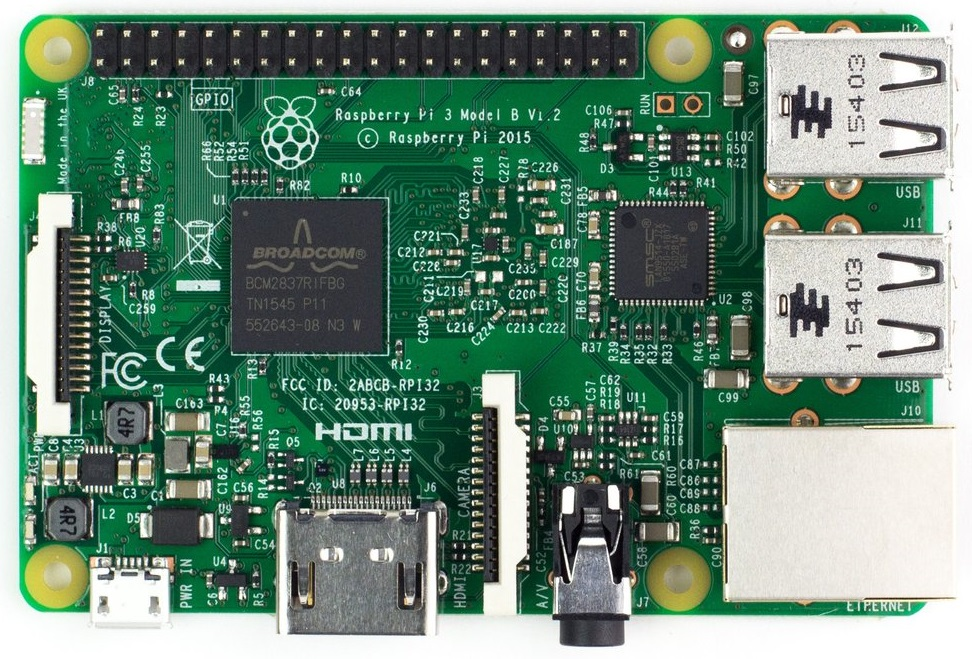
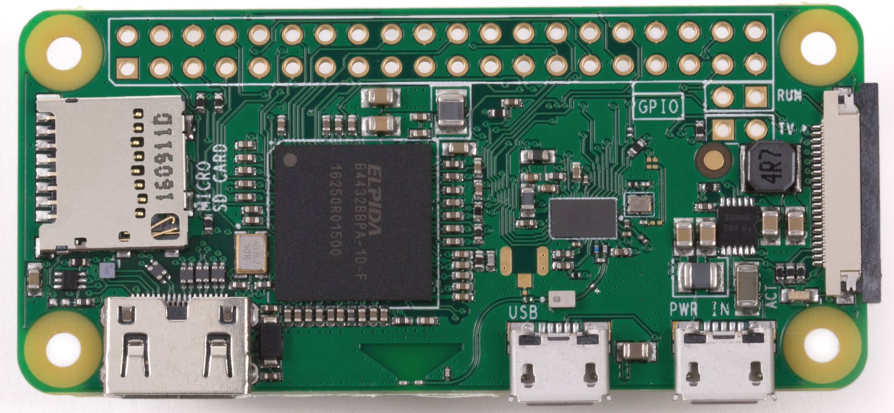
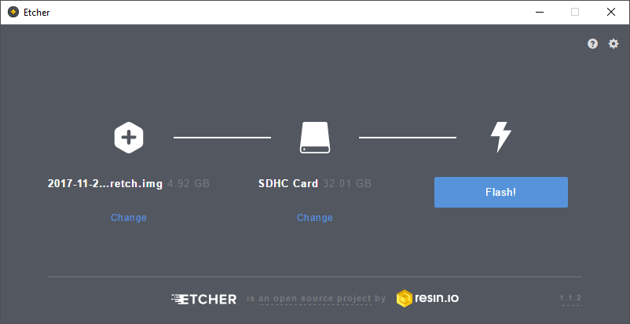
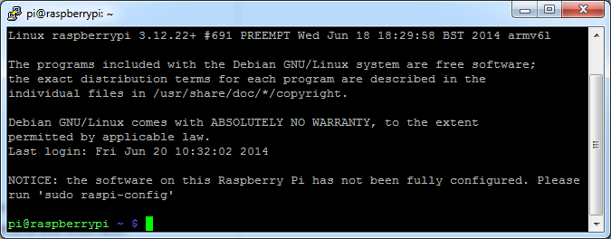
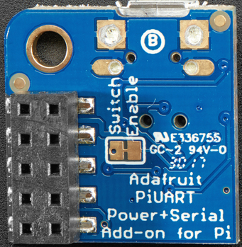
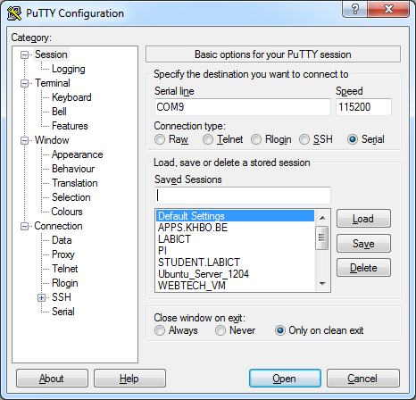
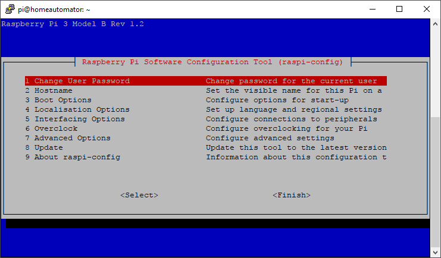
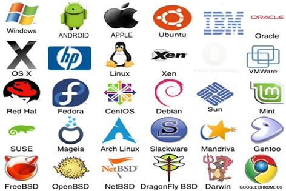

# The Raspberry Pi

The Raspberry Pi is a series of small single-board computers developed in the United Kingdom by the Raspberry Pi Foundation to promote the teaching of basic computer science in schools and in developing countries. The original model became far more popular than anticipated, selling outside of its target market for uses such as robotics. Peripherals (including keyboards, mice and cases) are not included with the Raspberry Pi. Some accessories however have been included in several official and unofficial bundles.

According to the Raspberry Pi Foundation, over 5 million Raspberry Pi's have been sold before February 2015, making it the best-selling British computer. By November 2016 they had sold 11 million units, reaching 12.5m in March 2017, making it the third best-selling "general purpose computer" ever. In July 2017 it was announced that the total sales have now reached nearly 15 million units.

## Specs

Source: https://en.wikipedia.org/wiki/Raspberry_Pi

The latest in line are the Raspberry Pi 3 and the Raspberry Pi Zero W

**The Raspberry Pi 3**:
* ARMv8-A (64/32-bit) architecture
* Broadcom BCM2837 SoC
* 1.2 GHz 64-bit quad-core ARM Cortex-A53 processor
* Broadcom VideoCore IV @ 250 MHz (BCM2837: 3D part of GPU @ 300 MHz, video part of GPU @ 400 MHz)
* OpenGL ES 2.0 (BCM2835, BCM2836: 24 GFLOPS / BCM2837: 28.8 GFLOPS)
* MPEG-2 and VC-1 (with license), 1080p30 H.264/MPEG-4 AVC high-profile decoder and encoder (BCM2837: 1080p60)
* 1GB of SDRAM (shared with GPU)
* 4 USB 2.0 ports (via the on-board 5-port USB hub)
* 15-pin MIPI camera interface (CSI) connector, used with the Raspberry Pi camera or Raspberry Pi NoIR camera
* HDMI (rev 1.3), composite video (3.5 mm TRRS jack), MIPI display interface (DSI) for raw LCD panels
* MicroSDHC slot
* 10/100 Mbit/s Ethernet, 802.11n wireless, Bluetooth 4.1
* 17 GPIO's

It draws 300 mA (1.5 W) average when idle, 1.34 A (6.7 W) maximum under stress (monitor, keyboard, mouse and WiFi connected).



**The Raspberry Pi Zero W**:
* ARMv6Z (32-bit) architecture
* Broadcom BCM2835 SoC
* 1 GHz single-core ARM1176JZF-S processor
* Broadcom VideoCore IV @ 250 MHz (BCM2837: 3D part of GPU @ 300 MHz, video part of GPU @ 400 MHz)
* OpenGL ES 2.0 (BCM2835, BCM2836: 24 GFLOPS / BCM2837: 28.8 GFLOPS)
* MPEG-2 and VC-1 (with license), 1080p30 H.264/MPEG-4 AVC high-profile decoder and encoder (BCM2837: 1080p60)
* 500MB of SDRAM (shared with GPU)
* 1 Micro-USB (direct from BCM2835 chip)
* MIPI camera interface (CSI)
* Mini-HDMI, 1080p60, composite video via marked points on PCB for optional header pins
* Audio via Mini-HDMI, stereo audio through PWM on GPIO
* MicroSDHC slot
* 802.11n wireless, Bluetooth 4.1
* 17 GPIO's

It draws 100 mA (0.5 W) average when idle, 350 mA (1.75 W) maximum under stress (monitor, keyboard and mouse connected).



## Raspberry Pi GPIO Pinout

The GPIO pinout of the Raspberry Pi has been standard since the Raspberry Pi 2. A very handy website is [https://pinout.xyz/](https://pinout.xyz/).

An overview of the pinout of the RPi is given below:

![Raspberry Pi 2/3/zero Pinout[^1]](img/raspberry_pi_pinout.png)

[^1]: Source https://pinout.xyz/

## Supported Operating Systems

The Raspberry Pi foundation provides several ready to use operating system images for the Pi. At the moment of this writing the following are available:

* Raspbian - The Foundation's official supported operating system (Debian Jessie)
* Ubuntu Mate - Official Ubuntu flavor featuring the MATE desktop
* Snappy Ubuntu Core - A new, transactionally-updated Ubuntu for IoT devices, clouds and more
* OSMC - Open Source Media Centre
* OPENELEC - Open Embedded Linux Entertainment Centre
* PINET - Raspberry Pi Classroom Management Solution
* Windows 10 IoT Core
* RISC OS - A non-Linux distribution

For this course we will be using the Raspbian image. While Ubuntu Mate features a nicer graphical environment, it does have some glitches when it comes to the graphical user interface.

While the instructions below on how to boot the Raspberry Pi are based on Raspbian, they are very similar for most other distributions.

## Creating a bootable SD card

You can download the latest image of Raspbian via the Raspberry Pi website ([https://www.raspberrypi.org/downloads/](https://www.raspberrypi.org/downloads/)). Make sure to pick the "Raspbian Stretch with Desktop" edition. Extract the compressed file on your local disk (using 7-Zip or a similar tool). You should get an image file (.img extension).

The current version at the moment of this writing is of November with a Linux kernel version of 4.9. You can always check out the release notes on [http://downloads.raspberrypi.org/raspbian/release_notes.txt](http://downloads.raspberrypi.org/raspbian/release_notes.txt).

To boot this Linux distribution we will need to write the image file to an SD card of at least 8GB. A popular tool to write the image to an SD card is "Etcher by Resin.io" which can be downloaded at [https://etcher.io](https://etcher.io)

> #### Note::Other host operating systems
>
> Check out [http://www.raspberrypi.org/documentation/installation/installing-images/README.md](http://www.raspberrypi.org/documentation/installation/installing-images/README.md) for instructions for different host operating systems such as Linux or Mac.

Select the correct device letter and load the Linux image from your local drive as shown in the image below. If you're ready, hit the write button and grab a cup of coffee. You can also create a backup of your current SD card by reading from the SD card to an image file. Just make sure to select a new image file name. Do take note that the img file will have the size of your SD card. So using an SD card of 32GB will result in a backup image of 32GB.



Once the write process is finished you can remove the SD card and plug it in the Raspberry Pi. Just make sure to disconnect the power before inserting the SD card.

If you want your Pi to be connected to your local area network (LAN), you will have to plug in the Ethernet cable before booting the Pi. The Pi is default configured to acquire an IP address using DHCP.

## Interacting with the Raspberry Pi

Booting the Raspberry Pi is really simple. All you have to do is fit in the SD card and plug in the supply adapter. It automatically boots from the SD card. Interacting with the Linux operating system from that point on can be a bit harder in certain situations.

### Graphical Desktop Environment

If you deployed an OS such as Raspbian than you can attach an HDMI display. You will also have to connect a USB keyboard to the Pi to be able to control the Pi. Depending on the edition (normal or lite), you will get a graphical desktop environment or a tty terminal.


### SSH Connection

Raspbian comes default with the SSH daemon disabled. It can be enabled via a startup file or via the `raspi-config` command (see later). SSH allows us to connect to the Pi from a remote computer using the SSH protocol. Before this can be done you will have to enable SSH and also determine the IP address of the Pi.

> #### Note::SSH
>
> SSH or Secure Shell is a secure way to connect to a device and execute commands from a distance. In the old days Telnet was the way to go but it sends all commands and login information as clear text. With SSH everything is encrypted. Default SSH daemon listen on port 22.

Connecting to a device using the SSH protocol can be easily achieved using a terminal tool such as Putty. All you have to do is start Putty and select the SSH connection option and specify the IP address of the device as shown in Figure 6. Once the connection is configured you can open it.

> #### Note::Putty
>
> PuTTY is a free implementation of Telnet and SSH for Windows and Unix platforms, along with an xterm terminal emulator. It can be downloaded from [http://www.chiark.greenend.org.uk/~sgtatham/putty](http://www.chiark.greenend.org.uk/~sgtatham/putty).


You will be presented with the command line interface (CLI) of the Linux operating system running on your device. The first thing you will see is a login screen similar to the one shown below.


The default username and password can be found on the Raspberry Pi website. For Raspbian it is "pi" as username and "raspberry" as password. Once you login with these credentials you are presented with the command line interface as shown below. From this point on you can start to execute commands on the Pi.



### RS232 Connection

A last option that can be used to connect to the Raspberry Pi is using a serial connection. This is often used for debugging embedded systems because it is a very basic connection type. Because of this the kernel will also output its kernel messages (debugging information and errors) to this connection. Since most computers these days lack the serial interface we can use a simple RS232 to USB converter such as the PL-2303HX (see [https://www.adafruit.com/datasheets/PL2303HX.pdf](https://www.adafruit.com/datasheets/PL2303HX.pdf) for datasheet) or you can use a readily available breakout board such as the "AdaFruit PiUART" (see [https://www.adafruit.com/product/3589](https://www.adafruit.com/product/3589))



Just as with SSH, you can use Putty for the serial terminal. Just select "serial" as connection type, "COMx" (where x is an integer number) as serial line and "115200" as speed. An example is shown in the figure below. Choose open and you will a get a command line interface similar to the one of SSH.



> #### Note::Determining the COM device
>
> You can find the COM port number in the device manager. Select the "Ports (COM & LPT)" category and look for a "USB-to-Serial Comm Port (COMx)" device.

If you reboot your Raspberry Pi at this moment you will see the kernel messages shown in the next figure mentioned earlier.


## Initial Configuration

> #### Warning::Keyboard Layout
>
> If you are using the Raspberry Pi using a display and keyboard you may want to change the keyboard layout before continuing to avoid typing command wrongly or setting a wrong password later on. In Raspbian go to the start menu (raspberry logo) at the top left corner. Next traverse to `Preferences => Mouse and Keyboard Setting => Keyboard => Keyboard Layout`. Now select "Belgium" as country and "Belgian" as variant.

Before doing anything with the Raspberry Pi its best to first configure the operating system. This can be achieved by executing the command below to get a graphical configuration menu:

```shell
sudo raspi-config
```



Generally speaking, `raspi-config` aims to provide the functionality to make the most common configuration changes. This may result in automated edits to  `/boot/config.txt` and various standard Linux configuration files. Some options require a reboot to take effect. If you changed any of those, `raspi-config` will ask if you wish to reboot now when you select the `<Finish>` button.

The most important options are discussed in the sections below.

### Hostname

Set the visible name for this Pi on a network.

### Change User Password

The `Change User Password` option allows you to change the default password of the `pi` user. Make sure to do this before continuing. Watch out if you do this using an external keyboard as the keyboard layout may be configured to qwerty. In this case configure the keyboard layout first as mentioned before.

### Boot Options

Here you can change what happens when your Pi boots. Use this option to change your boot preference to command line, desktop, or straight to Scratch (graphical programming).

### Localization Options

This will open up a sub menu with internationalization options to configure such as your locale and timezone.

#### Locale

Locales are a framework to switch between multiple languages and allow users to use their language, country, characters, collation order, etc.

In the first screen you will be asked which locales to generate. UTF-8 locales should be chosen by default, particularly for new installations. Other character sets may be useful for backwards compatibility with older systems and software.

Select both `en_US.UTF-8 UTF-8` and `nl_BE.UTF-8 UTF-8`. On the next screen you can pick any of these two to be the default locale.

#### Change Timezone

The time zone should be changed to "Europe – Brussels" to reflect our own time zone.

### Interfacing Options

Allows us to enable and disable all sorts of interfaces that connect with external peripherals and/or services.

#### Enable Camera

In order to use the Raspberry Pi camera module, you must enable it here. This option will also make sure at least 128MB of RAM is dedicated to the GPU.

#### SSH

Enable/disable remote command line access to your Pi using SSH (Secure Shell).

SSH allows you to remotely access the command line of the Raspberry Pi from another computer. Disabling this ensures the SSH service does not start on boot, freeing up processing resources. Note that SSH is disabled by default. If connecting your Pi directly to a public network, you should disable SSH unless you have set up secure passwords for all users.

#### SPI

Enable/disable automatic loading of SPI (Serial Peripheral Interface) kernel module, needed for products such as PiFace.

#### I2C

Enable/Disable I2C interfaces and automatic loading of the I2C kernel module. Make sure to enable this as our hardware shield (TouchBerry Pi) makes use of I2C to communicate with the RPi.

### Advanced Options

The advanced options allow the configuration of the more specialized options such as overscan, the division of the memory with the GPU, OpenGL drivers and so on.

#### Expanding the Filesystem

The first thing we need to do is expand the filesystem. Currently we are using SD cards of 8GB, 16GB or 32GB but the root file system only takes up about 3GB (with more than 80% in use). So to expand the root filesystem to the full SD card we can use the Expand Filesystem configuration script. You will need to reboot the Raspberry Pi to make this available.

#### Overscan

Old TV sets had a significant variation in the size of the picture they produced; some had cabinets that overlapped the screen. TV pictures were therefore given a black border so that none of the picture was lost; this is called overscan. Modern TVs and monitors don't need the border, and the signal doesn't allow for it. If the initial text shown on the screen disappears off the edge, you need to enable overscan to bring the border back.

On some displays, particularly monitors, disabling overscan will make the picture fill the whole screen and correct the resolution. For other displays, it may be necessary to leave overscan enabled and adjust its values.

Any changes will take effect after a reboot.

#### Memory Split

Change the amount of memory made available to the GPU (Graphics Processing Unit). When using a graphical desktop environment make sure to give the GPU at least 64MB.

### Update

Update this tool (raspi-config) to the latest version. This requires an active Internet connection.

## Some Important Linux Stuff

The Raspberry Pi 3 embedded system is quite a complex system with a lot of features and complicated hardware. While it is possible to write software that runs directly on the embedded processor (called a bare-metal application) it is way to complex. Typically an Operating System (OS) is installed to manage all the hardware and resources making it easier for software developers to create application to run on the system. That way the hardware can be accessed through services provided by the OS.

Choosing an operating system for an embedded system mainly depends on the hardware as not each operating system will provide support for the embedded system.

Some existing operating systems are shown in the image below:



The main operating systems that have support for the Raspberry Pi 3 are:

* Raspbian, Ubuntu Mate, OSMC, OpenElec, ... (Linux based)
* Windows IoT core (Windows based)
* Risc OS (Real-time OS)

Further down the course we will focus on the Raspbian linux distribution.

## Linux kernel and Linux Distribution

Linux was originally developed as a free operating system for personal computers based on the Intel x86 architecture, but has since been ported to more computer hardware platforms than any other operating system. This includes desktop PCs, servers, mainframes, supercomputers, smartphones, tablets, TVs, embedded systems, ...

Guess what your TV decoder at home is running.

When people refer to linux, it can actually mean two different things.

First is the Linux kernel which was created in 1991 by a Finnish computer science student called Linus Torvalds. It was based on the Minix operating system. Linus made the project open source and allowed people to freely use and contribute to the Linux kernel. Currently the official kernel received contributions from over 12000 programmers.

Second, are so-called "Linux distributions", also called distros. They are complete operating systems that consist of the Linux kernel itself and many other applications and software packages. Because they typically contain a lot of software created by the GNU project, some people (mostly GNU guys themselves) claim that they should be called GNU/Linux instead of just Linux.

When we are talking about embedded Linux we actually are talking about the same kernel code running on millions of other systems. There is no separate code base for embedded systems. When we however build a Linux system for an embedded target we do exclude features we won't be using. We are also cross-compiling the kernel to binary code that can run on the target system.

### The Linux kernel

The Linux kernel **provides the core system facilities** required for any system based upon Linux to operate correctly. It has complete control over everything that occurs in the system. Application software relies upon specific features of the Linux kernel such as its handling of hardware devices and its **provision of many fundamental abstractions** such as virtual memory, sockets, tasks (known as processes), files and many others.

## Debian and it's Packages

Every Linux distribution is different in terms of how software is installed. Linux distributions use different installation file types, package managers, and commands for installation. Even within a single form of Linux, there are different types of package managers.

Debian files are usually downloaded by package managers from a software repository. A repository is a collection of Debian files that typically comes from a server or other location. Package managers access these repositories and download the requested Debian file. Then, the package manager installs the package. A package manager is software used to handle the installation, removal, configuration, and updating of programs and drivers on a computer system. If a Debian file is not downloaded from a repository, then the user downloaded or created a Debian file. The local file can still be installed; Debian files are not required to come from a repository, although most do.

Packages generally contain all of the files necessary to implement a set of related commands or features. There are two types of Debian packages:

* **Binary packages**, which contain executables, configuration files, man/info pages, copyright information, and other documentation. These packages are distributed in a Debian-specific archive format; they are usually distinguished by having a '.deb' file extension. Binary packages can be unpacked using the Debian utility dpkg (possibly via a frontend like aptitude).
* **Source packages**, which consist of a .dsc file describing the source package (including the names of the following files), a .orig.tar.gz file that contains the original unmodified source in gzip-compressed tar format and usually a .diff.gz file that contains the Debian-specific changes to the original source. The utility dpkg-source packs and unpacks Debian source archives. (The program apt-get can be used as a frontend for dpkg-source.)

Installation of software by the package system uses "dependencies" which are carefully designed by the package maintainers. These dependencies are documented in the control file associated with each package.

There are multiple tools that are used to manage Debian packages, from graphic or text-based interfaces to the low level tools used to install packages. All the available tools rely on the lower level tools to properly work.

It is important to understand that the higher level package management tools such as aptitude or dselect rely on apt which, itself, relies on dpkg to manage the packages in the system.

### DPKG

Dpkg is the main package management program.

### APT

APT is the Advanced Package Tool and provides the apt-get program. apt-get provides a simple way to retrieve and install packages from multiple sources using the command line. Unlike dpkg, apt-get does not understand .deb files, it works with the packages proper name and can only install .deb archives from a source specified in /etc/apt/sources.list. apt-get will call dpkg directly after downloading the .deb archives from the configured sources.

> #### Warning::sudo
>
> Most of the commands below must be issued with administrative privileges. In Linux this is accomplished by placing `sudo ` before the command. For example: `sudo apt-get update`.

Some common ways to use apt-get are:

* To update the list of package known by your system, you can run:

```shell
apt-get update
```

(you should execute this regularly to update your package lists)

* To upgrade all the packages on your system (without installing extra packages or removing packages), run:

```shell
apt-get upgrade
```

* To install the foo package and all its dependencies, run:

```shell
apt-get install foo
```

* To remove the foo package from your system, run:

```shell
apt-get remove foo
```

* To remove the foo package and its configuration files from your system, run:

```shell
apt-get purge foo
```

* To upgrade all the packages on your system, and, if needed for a package upgrade, installing extra packages or removing packages, run:

```shell
apt-get dist-upgrade
```

### Aptitude

Aptitude is a package manager for Debian GNU/Linux systems that provides a frontend to the apt package management infrastructure. Aptitude is a text-based interface using the curses library, it can be used to perform management tasks in a fast and easy way.

* aptitude offers easy access to all versions of a package.
* aptitude makes it easy to keep track of obsolete software by listing it under "Obsolete and Locally Created Packages".
* aptitude includes a fairly powerful system for searching particular packages and limiting the package display. Users familiar with mutt will pick up quickly, as mutt was the inspiration for the expression syntax.
* aptitude can be used to install the predefined tasks available.
* aptitude in full screen mode has `su` functionality embedded and can be run by a normal user. It will call `su` (and ask for the root password, if any) when you really need administrative privileges

Aptitude is most commonly used for searching for packages. You can use the following command for this:

```shell
aptitude search foobar
```

You can launch the 'graphical' frontend by running it from the terminal:

```shell
aptitude
```
