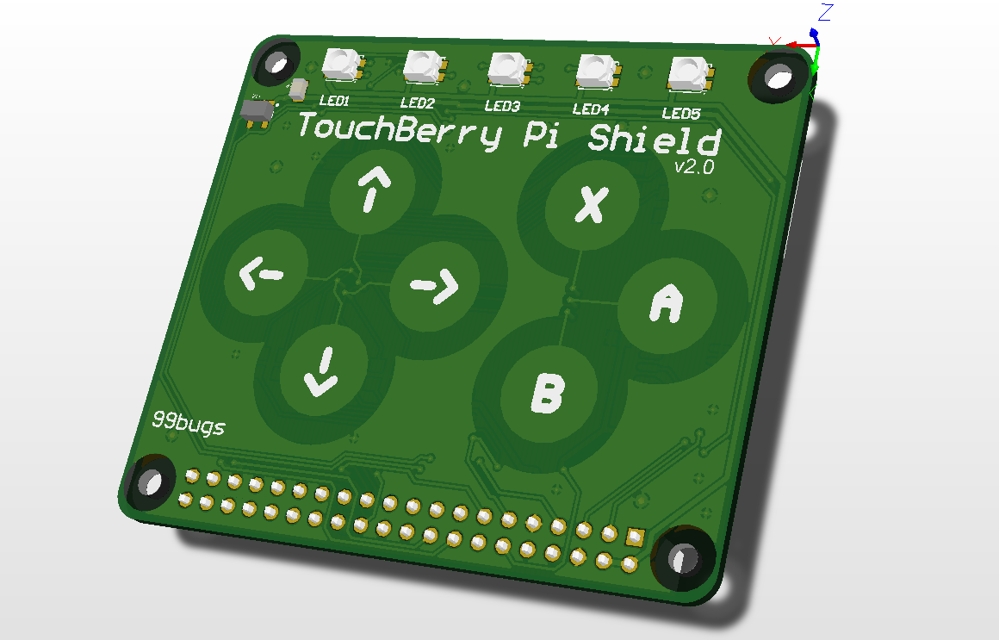
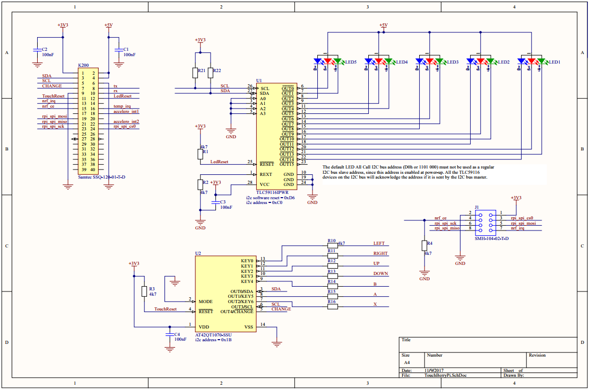
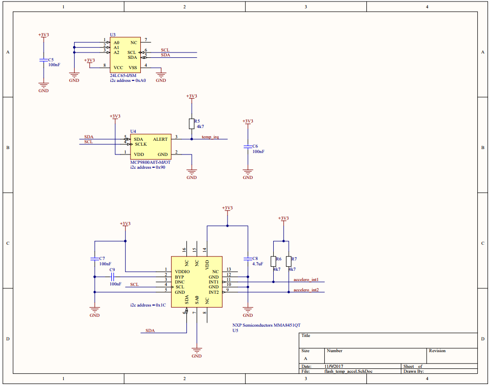
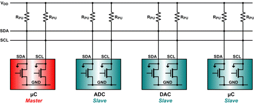
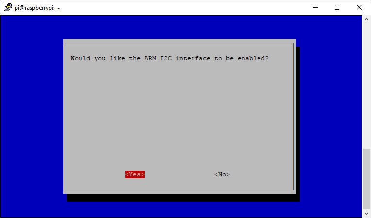

# The Touchberry Pi Shield

The Touchberry Pi shield is a shield that can be plugged on top of the Raspberry Pi (2, 3 and Zero) and enables a touch interface through 7 capacitive buttons. It also equipped with other hardware such as 5 RGB LED's that allow us to output some information to the user.



Version 2.0 of the shield has the following hardware on board:
* AT42QT1070 I2C capacitive touch sensor IC [https://www.mouser.com/ds/2/268/Atmel-9596-AT42-QTouch-BSW-AT42QT1070_Datasheet-1065970.pdf](https://www.mouser.com/ds/2/268/Atmel-9596-AT42-QTouch-BSW-AT42QT1070_Datasheet-1065970.pdf)
* TLC59116 I2C-Bus Constant-Current LED Sink Driver [http://www.ti.com/lit/ds/symlink/tlc59116.pdf](http://www.ti.com/lit/ds/symlink/tlc59116.pdf)
* 5 RGB LEDs
* 24LC65 64K I2C Smart Serial EEPROM [http://ww1.microchip.com/downloads/en/DeviceDoc/21073K.pdf](http://ww1.microchip.com/downloads/en/DeviceDoc/21073K.pdf)
* MCP9800 2-Wire High-Accuracy Temperature Sensor [http://ww1.microchip.com/downloads/en/DeviceDoc/21909d.pdf](http://ww1.microchip.com/downloads/en/DeviceDoc/21909d.pdf)
* MMA8451QT MEMS Accelerometer, 3-Axis [https://www.nxp.com/docs/en/data-sheet/MMA8451Q.pdf](https://www.nxp.com/docs/en/data-sheet/MMA8451Q.pdf)
* An NRF-compatible connector for connecting NRF24l01+ modules (allowing small distance baseband low power wireless communication)

The schematic of the QT1070 touch sensor and the TLC59116 LED driver is shown below:



The schematic of the other sensors is shown below:



All these ICs (Integrated Circuits) are connected to the Raspberry Pi via an I2c (Inter-Integrated-Circuit) bus that allows communication via 2 wires.

## Communicating using I2C

Why I2c and not for example serial port? Because serial ports are asynchronous (no clock data is transmitted), devices using them must agree ahead of time on a data rate. The two devices must also have clocks that are close to the same rate, and will remain so–excessive differences between clock rates on either end will cause garbled data.

Another core fault in asynchronous serial ports is that they are inherently suited to communications between two, and only two, devices. While it is possible to connect multiple devices to a single serial port, bus contention (where two devices attempt to drive the same line at the same time) is always an issue and must be dealt with carefully to prevent damage to the devices in question, usually through external hardware.

Finally, data rate is an issue. While there is no theoretical limit to asynchronous serial communications, most UART devices only support a certain set of fixed baud rates.

Advantages of I2c
* Its a common standard
* Its "fast" for low-speed devices (100kHz and 300kHz are typical speeds)
* Bus (multiple devices can be connected)
* Easy to use
* Wide support
* Only 2 communication lines needed (SDA and SCL)
 * SCL is the clock line (it is used to synchronize all data transfers over the I2C bus)
 * SDA is the data line
* The SCL and SDA lines are connected to all devices on the I2C bus
* There does need to be a third wire which is the ground



Both SCL and SDA lines are "open drain" drivers. What this means is that the chip can drive its output low, but it cannot drive it high. For the line to be able to go high you must provide pull-up resistors to Vcc. There should be a resistor from the SCL line to Vcc and another from the SDA line to Vcc. You only need one set of pull-up resistors for the whole I2C bus, not for each device. Vcc depends on the devices used. Typically 5V or 3V3

The devices on the I2C bus are either masters or slaves. The master is always the device that drives the SCL clock line. The slaves are the devices that respond to the master. A slave cannot initiate a transfer over the I2C bus, only a master can do that. There can be, and usually are, multiple slaves on the I2C bus, however there is normally only one master. It is possible to have multiple masters, but it is unusual. Slaves will never initiate a transfer. Both master and slave can transfer data over the I2C bus, but that transfer is always controlled by the master.

## I2c on the Raspberry Pi 3

As part of the B+ improvements, the Raspberry Pi Foundation has standardized the interface to add-on boards, in what they call the "Hardware Added On Top" (HAT) specification. It standardizes the physical form factor for add-on boards, and includes a provision for the B+ to automatically identify and initialize HATs at startup. It uses an I2C bus to read a description from an EEPROM on the HAT.

This capability has been carried forward on the A+ and Pi 2 Model B as well. This I2C bus is found on the ID_SC and ID_SD pins (pins 27 and 28 of the 40-pin connector) - but before you get too excited about adding peripherals on that bus, observe the note in the schematic for that port.

![Schematic snippet for 40-Pin GPIO connector [^1]](img/bplus-gpio.png)

[^1]: Source https://learn.sparkfun.com/tutorials/raspberry-pi-spi-and-i2c-tutorial

On the Raspberry Pi the I2C is not turned on by default. We can use `raspi-config` to enable it. Traverse to `Interfacing Options => I2C => Enable`. The RPi will need to reboot.



When it comes back up, log in and enter the following command:

```shell
ls /dev/*i2c*
```

The following output should be given:

```shell
/dev/i2c-1
```

Which represents the user-mode I2C interface. Remember that in Linux almost everything is a file. The same goes for the I2c interface. It is actually accessed via a device-file.

## I2c-tools

i2c-tools is a useful package that allows us to scan the I2C bus for devices. Very useful for debugging and testing.

Install the tools using the following command:

```shell
sudo apt-get update && sudo apt-get install i2c-tools
```

Once the shield is plugged on top of the Raspberry Pi (effectively connecting all the IC's), you can use the i2cdetect tool to scan the bus for slave devices.

Use the i2cdetect tool to scan the bus `i2cdetect -r 1`. For example:

```shell
i2cdetect -r 1
```
You should get output similar to the one shown below

```text
pi@raspberrypi:~ $ i2cdetect -r 1
WARNING! This program can confuse your I2C bus, cause data loss and worse!
I will probe file /dev/i2c-1 using read byte commands.
I will probe address range 0x03-0x77.
Continue? [Y/n]
     0  1  2  3  4  5  6  7  8  9  a  b  c  d  e  f
00:          -- -- -- -- -- -- -- -- -- -- -- -- --
10: -- -- -- -- -- -- -- -- -- -- -- 1b 1c -- -- --
20: -- -- -- -- -- -- -- -- -- -- -- -- -- -- -- --
30: -- -- -- -- -- -- -- -- -- -- -- -- -- -- -- --
40: -- -- -- -- -- -- -- -- 48 -- -- -- -- -- -- --
50: 50 -- -- -- -- -- -- -- -- -- -- -- -- -- -- --
60: 60 -- -- -- -- -- -- -- 68 -- -- -- -- -- -- --
70: -- -- -- -- -- -- -- --
```

Let us take a look at what devices are being detected:
* `0x1b`: AT42QT1070 I2C capacitive touch sensor IC
* `0x1c`: MMA8451QT MEMS Accelerometer, 3-Axis
* `0x48`: MCP9800 2-Wire High-Accuracy Temperature Sensor
* `0x50`: 24LC65 64K I2C Smart Serial EEPROM
* `0x60`: TLC59116 I2C-Bus Constant-Current LED Sink Driver
* `0x68`: TLC59116 I2C-Bus Constant-Current LED Sink Driver All Call Address

Notice that all these addresses are the 7bit addresses. Some datasheets specify the 8bit address (R/W bit included as LSB `0`). This means that the 8bit address is the 7bit address multiplied by 2.
